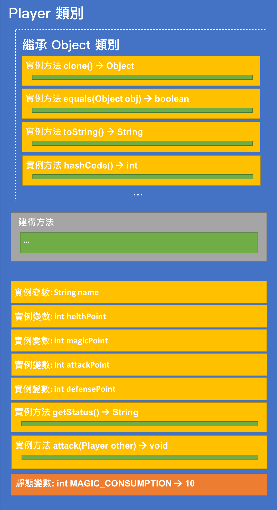

<!-- .slide: data-background="assets/background.png" -->


## 宣告抽象類別並實作抽象方法

---

# 回顧: Player 類別

<div style="height: 45rem;">

</div>

---

# 回顧: Warrior 類別

<div style="height: 45rem;">

</div>

---

# 情境 & 思考

* Warrior 類別: 建構出來的實例是`職業為戰士`的玩家
* Player 類別: 建構出來的實例是 `沒有職業` 的玩家

> 職業別決定了玩家攻擊的行為 (attack方法）

---

# 情境 & 思考


> 未必有不妥，一切要視程式本身的需求而定

---

# 情境 & 思考

* 假設我們現在不容許沒有職業的玩家
* 然後新增一種職業: `Thief`(盜賊) 職業
* 盜賊職業的攻擊方式和原先普通`Player`的方式一樣

---

# 抽象類別


---

# 把 Player 宣告為抽象類別

```java
public abstract class Player {

}
```

---

# 定義抽象 attack 方法

* 抽象類別內可以封裝`抽象方法`
* 抽象方法:
  * 僅宣告`方法名`、`參數`、`回傳型別`、`修飾子`
  * 不宣告 `內部陳述`

> 只規範要有攻擊行為，卻不規範如何攻擊

---

# 定義抽象 attack 方法

```java
public abstract void attack(Player other);
```

> 注意要用分號結尾

<!--暫時複製Player attack 實作到別處-->

---

# 修正 Warrior 當中的錯誤

* 由於父類再也不過問如何攻擊了，子類`Warrior` 要自行定義完整的攻擊行為

```java
@Override
public void attack(Player other) {
    super.attack(other); // 錯誤!
    if (Math.random() <= comboRate) {
        int harm = attackPoint - other.defensePoint;
        other.healthPoint -= harm;
        System.out.println("COMBO! " + name + "造成" + other.name + "傷害: " + harm);
    }
}
```

---

# 宣告 Thief 類別

```java
public class Thief extends Player {

	public Thief(String name, int healthPoint, int magicPoint, int attackPoint, int defensePoint) {
		super(name, healthPoint, magicPoint, attackPoint, defensePoint);

	}

}
```
> 子類建構方法需呼叫父類建構方法

---

# Thief 類被規範: 一定要有 attack 方法

* 必須定義一個`Thief`該`如何`攻擊

```java
public class Thief extends Player {

	public Thief(String name, int healthPoint, int magicPoint, int attackPoint, int defensePoint) {
		super(name, healthPoint, magicPoint, attackPoint, defensePoint);
		// TODO Auto-generated constructor stub
	}

	@Override
	public void attack(Player other) {
		if (!canAttack()) {
			System.out.println(name + "法力耗盡，無法攻擊");
			return;
		}
		magicPoint -= Player.MAGIC_CONSUMPTION;
		int harm = attackPoint - other.defensePoint;
		other.healthPoint -= harm;
		System.out.println(name + "造成" + other.name + "傷害: " + harm);

	}

}
```

---

## 把抽象方法實際行為定義出來的動作又稱
# 『實作』

---

# 抽象類別`不可`直接被建構出

```java
// 錯誤!
Player playerB = new Player("玩家B", 100, 200, 80, 30);
```

---

# 抽象類別`不可`直接被建構出

<div style="height: 30rem;">

</div>

> 只能建構非抽象的子類


---


