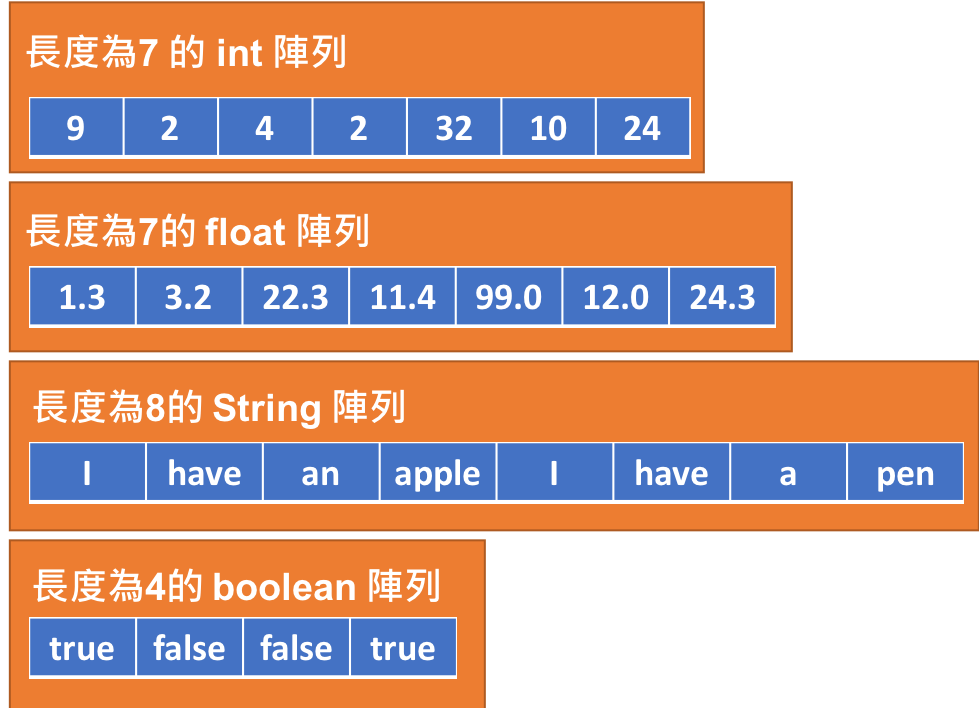
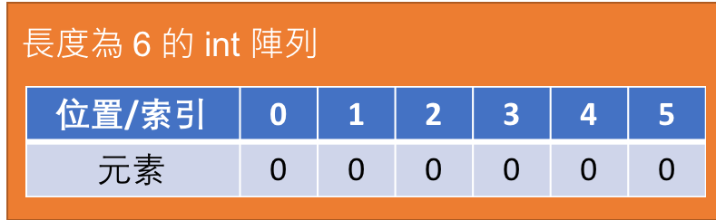
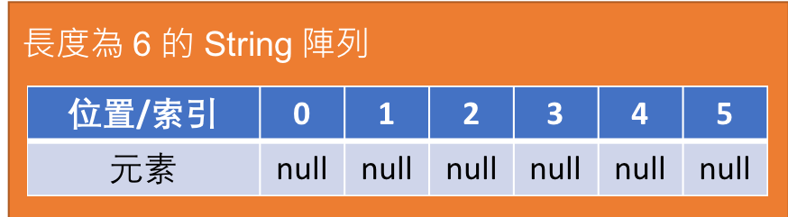

<!-- .slide: data-background="assets/background.png" -->


## 陣列的宣告與使用

---

# 情境 & 思考

* 設計一程式，詢問`6`位使用者的身高
* 6個身高都問到了之後，向使用者詢問，`請問要查詢誰的身高? (1~6)`
* 假設使用者回答`i`，印出`第i位`使用者當初輸入的身高

---

# 用之前學到的語法

```java
int height1 = 0;
int height2 = 0;
int height3 = 0;
int height4 = 0;
int height5 = 0;
int height6 = 0;

for (int i = 1; i <= 6; i++) {

    System.out.println("請輸入第" + i + "位的身高: ");
    int height = sc.nextInt();
    if (i == 1) {
        height1 = height;
    } else if (i == 2) {
        height2 = height;
    } else if (i == 3) {
        height3 = height;
    } else if (i == 4) {
        height4 = height;
    } else if (i == 5) {
        height5 = height;
    } else if (i == 6) {
        height6 = height;
    }
}

System.out.println("請問要查詢哪位身高? (1 ~ 6)");
int number = sc.nextInt();

if (number == 1) {
    System.out.println(height1);
} else if (number == 2) {
    System.out.println(height2);
} else if (number == 3) {
    System.out.println(height3);
} else if (number == 4) {
    System.out.println(height4);
} else if (number == 5) {
    System.out.println(height5);
} else if (number == 6) {
    System.out.println(height6);
}
```

---

# 情境 & 思考

* 如果今天使用者不是`6`位，而是`600`位、`6000`位怎麼辦？

---

# 陣列 Array

* 是 Java 的一個型別 (參考型別)
* 是一個擁有固定 `長度` 的 `容器`
* 容器內可放置多個`同一型別`的值

> 可以把陣列想成一個集合

---

# 陣列 Array

<div style="height: 30rem;">

</div>

> 陣列亦是一種資料結構

---

# 陣列的宣告

* 宣告一個長度為`6`的`int`陣列
```
int[] arr = new int[6];
```

<div style="height: 30rem;">

</div>

---

# 更新某位置上的元素

```java
arr[0] = 39;
arr[1] = 18;
arr[2] = 27;
arr[3] = 64;
arr[4] = 78;
arr[5] = 24;
```

---

# 讀取某位置上的元素

```java
System.out.println("第1元素值: " + arr[0]);
System.out.println("第2元素值: " + arr[1]);
System.out.println("第3元素值: " + arr[2]);
System.out.println("第4元素值: " + arr[3]);
System.out.println("第5元素值: " + arr[4]);
System.out.println("第6元素值: " + arr[5]);
```

---

# 以陣列改寫身高程式

```java
int[] heights = new int[6];
for (int i = 0; i < 6; i++) {

    System.out.println("請輸入第" + (i + 1) + "位的身高: ");
    heights[i] = sc.nextInt();
}

System.out.println("請問要查詢哪位身高? (1 ~ 6)");
int number = sc.nextInt();
System.out.println(heights[number - 1]);
```


---

# 取得陣列的長度

```java
System.out.println("陣列長度: " + arr.length);
```

---

# 改寫 for 的計數器上限

```java
for (int i = 0; i < heights.length; i++) {
    // ...
}
```

---

# 陣列元素初始值

<div style="height: 30rem;">

</div>

---

# 陣列元素初始值

* 如果是`long`,`int`,`short`,`byte`陣列: `0`
* 如果是`double`,`float`陣列: `0.0`
* 如果是 `boolean` 陣列: `false`
* 如果是 `char` 陣列: `'\u0000'` (相當於0)

---

# 陣列元素初始值

* 如果是參考型別(例如 String): `null`

```java
String[] arr = new String[6]
```




---

# 列舉式陣列宣告

```java
int[] arr = new int[] { 11, 22, 33, 44, 55, 66 };
```


