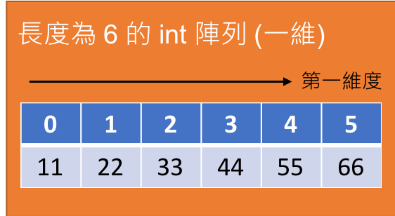

<!-- .slide: data-background="assets/background.png" -->


## 認識多維度陣列

---

# 維度 (Dimension)

* 決定一個元素需用`幾個索引`來標記位置
* 一維陣列: 只需一個索引
<div style="height: 20rem;">

</div>

---

# 二維陣列

* 需要`2`個索引才能標記元素位置

<div style="height: 40rem;">

</div>

---

# 宣告二維陣列

```java
int[][] arr = new int[3][6];
```

---

# 更新二維陣列元素值

```java
arr[0][0] = 11;
arr[0][1] = 22;
arr[0][2] = 33;
arr[0][3] = 44;
arr[0][4] = 55;
arr[0][5] = 66;
arr[1][0] = 44;
arr[1][1] = 55;
arr[1][2] = 66;
arr[1][3] = 77;
arr[1][4] = 88;
arr[1][5] = 99;
// ...
```

---

# 讀取二維陣列元素值

```java
System.out.println("位於 1,4 的元素是:" + arr[1][4]);
```


---

# 三維陣列

* 需要`3`個索引才能標記元素位置

<div style="height: 40rem;">

</div>

---


# 宣告並操作三維陣列

```java
// 宣告
int[][][] arr = new int[3][6][2];
// 寫入某位置
arr[1][5][0] = 99;
// 讀取某位置的元素值
System.out.println("位於 1,5,0 位置的元素是:"+ arr[1][5][0]);
```

---

# 我們如何理解 4 維以上的陣列?

---

# 多維度陣列: 以巢狀一維陣列來理解

* 二維陣列: `一維陣列`裡又有另一個`一維陣列`

<div style="height: 20rem;">

</div>

<div style="height: 40rem;">

</div>

---


# 取得各維度的長度

```java
int[][] arr = new int[3][6];

int[] arr0 = arr[0];
int[] arr1 = arr[1];
int[] arr2 = arr[2];

System.out.println("arr 長度:" + arr.length);
System.out.println("arr0 長度: "+ arr0.length);
System.out.println("arr1 長度: "+ arr1.length);
System.out.println("arr2 長度: "+ arr2.length);
```

---

# 取得各維度的長度

```java
int[][] arr = new int[3][6];
System.out.println("arr 第一維長度:" + arr.length);
System.out.println("arr 第二維長度: "+ arr[0].length);
```

---

# 列舉式宣告二維陣列

```java
int[][] arr = new int[][] { { 11, 22, 33, 44, 55, 66 }, 
                            { 44, 55, 66, 77, 88, 99 },
                            { 33, 44, 55, 66, 77, 88 } };
```

---

# for 迴圈走訪二維陣列

```java
int[][] arr = new int[][] { { 11, 22, 33, 44, 55, 66 }, 
                            { 44, 55, 66, 77, 88, 99 },
                            { 33, 44, 55, 66, 77, 88 } };

for (int i = 0; i < arr.length; i++) {
    for (int j = 0; j < arr[0].length; j++) {
        System.out.println("arr[" + i + "][" + j + "] = " + arr[i][j]);
    }
}
```