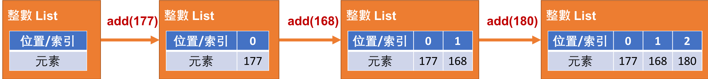

<!-- .slide: data-background="assets/background.png" -->


# Java 集合: List
# 認識 ArrayList 類別

---

# Array 不是就算集合了嗎？

---

# Array 定義上算是集合了，但對開發者來說還不夠方便。

---

# Java 的集合 (Collection) 
## 特指一些能針對特定情境下，對開發者提供更方便操作的集合。

---

# Java 的集合種類
## `List`, `Set`, `Map`, `Queue`

---

# 情境 & 思考

* 設計一程式，宣告一陣列用來記錄身高
* 程式會不斷重複請使用者輸入`指令`
* 假設使用者輸入 `add 177` 指令，代表使用者想添加一筆身高177的資料
* 每一條指令做完後，都要印出身高陣列現況。

---

# 情境 & 思考

```
請輸入指令:
add 177
[177]
請輸入指令:
add 168
[177,168]
請輸入指令:
add 180
[177,168,180]
```

---

# List 集合/資料結構



---

# 只有 `ListOfInt` 還不夠
## 能不能有 `ListOfString`, `ListOfFloat`, `ListOfXXXX` ?

---

# 改編成`泛型類別`

---

# List

* 與 Array 一樣:
  * 元素有序
  * 以索引找元素
* 與 Array 不一樣:
  * 預設大小為0, 隨需要自動增長
  * 提供更多方便開發者的操作 (ex. `新增`,`刪除`,`插入`)

---

# 情境 & 思考

* 刪除指令: `removeAt 2`
  * 表示要刪除`索引為2`的元素
  * 由於位置2空出了，更後面的元素索引要順勢往前移動

---

# 情境 & 思考

```
...
[177,168,180]
請輸入指令:
removeAt 1
[177,180]
請輸入指令:
removeAt 0
[180]
請輸入指令:
removeAt 0
[]
```

---

# 情境 & 思考

* 插入指令: `insert 1 166`
  * 表示要在`索引為1`的地方插入一筆`166`元素
  * 原先在`索引為1`的元素，以及它之後的元素，要順勢右移

---

# 情境 & 思考

```
...
[177,168,180]
請輸入指令:
insert 1 166
[177,166,168,180]
請輸入指令:
insert 2 157
[177,166,157,168,180]
```

---

# 情境 & 思考

* 更新指令: `upadte 2 165`
  * 表示要把目前在`索引2`的元素取代為`165`

---

# 情境 & 思考

```
...
[177,166,157,168,180]
請輸入指令:
update 2 165
[177,166,165,168,180]
```

---

# 情境 & 思考

* 清空指令: `clear`
  * 表示要刪除所有元素

---

# 情境 & 思考

```
...
[177,166,165,168,180]
請輸入指令:
clear
[]
```

---

# ArrayList 也能用 for-each 迴圈走訪

