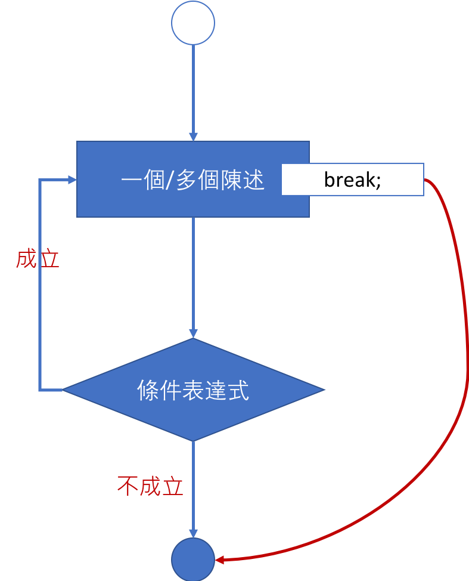
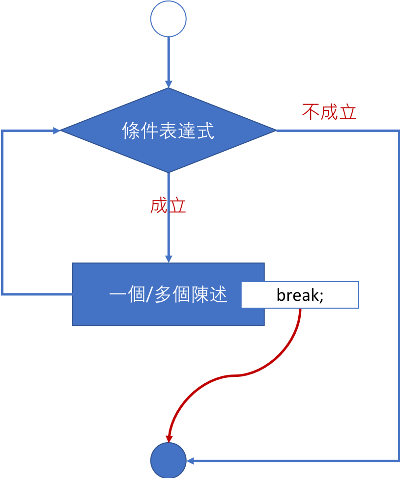
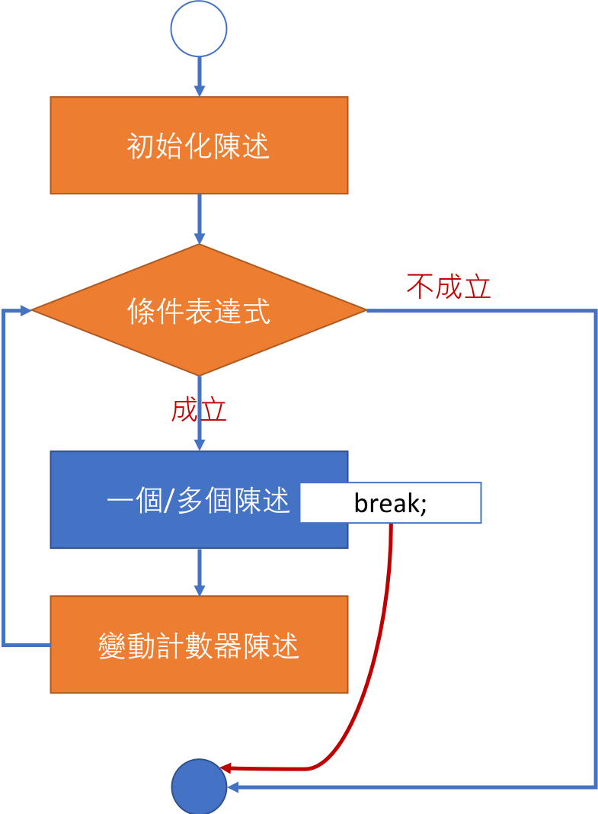
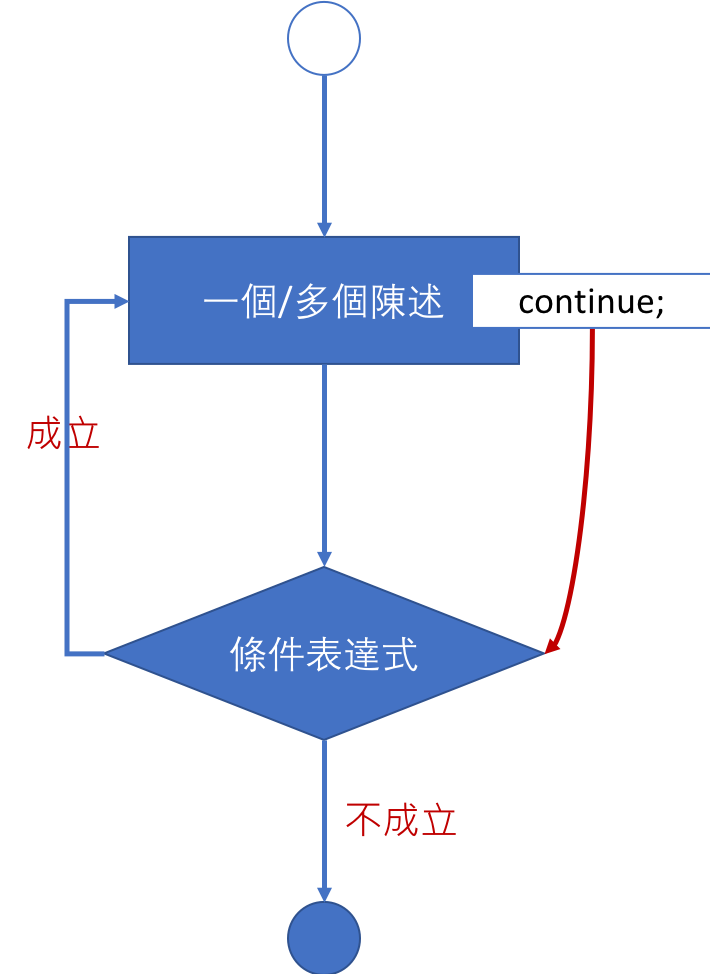
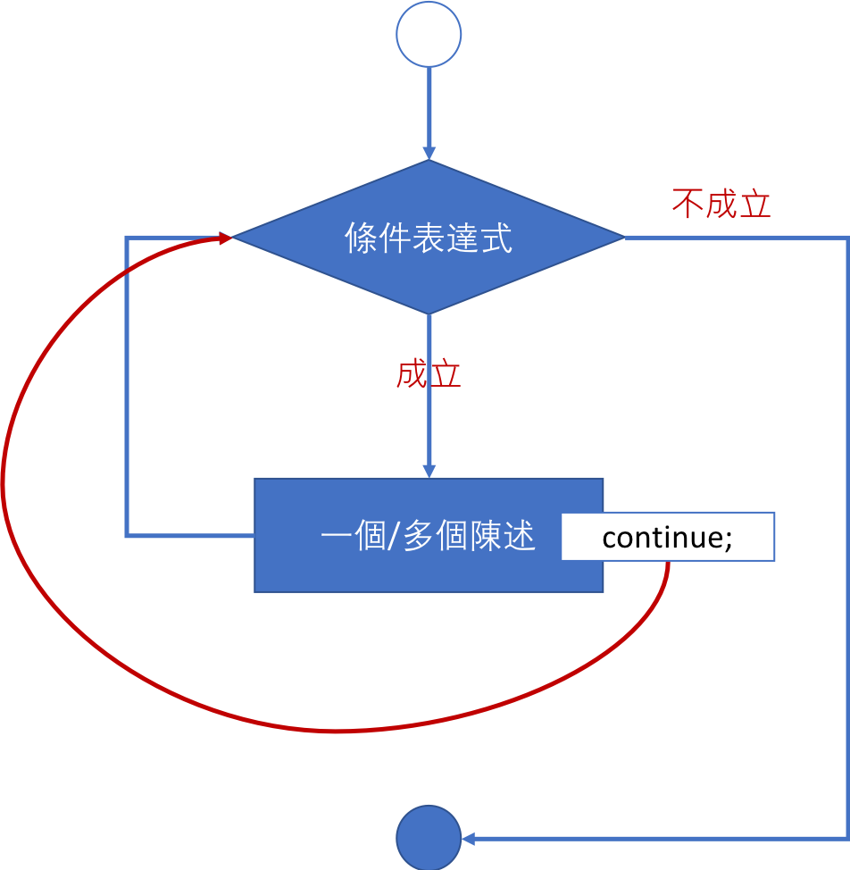

<!-- .slide: data-background="assets/background.png" -->


## 認識 break 與 continue 陳述

---

# 情境 & 思考

* 如何讓以下程式顯示一筆身高後:
  1. 詢問使用者: `還要繼續嗎?(要,請輸入y)`
  2. 若使用者不想繼續，要印出`再見!`

```java
Scanner sc = new Scanner(System.in);
do {
    System.out.println("請輸入身高:");
    int height = sc.nextInt();
    System.out.println("你的身高是 " + height + " 公分");

} while (true);
```

---

#  break 用途

1. 在 `while`,`for`,`do-while` 迴圈結構中，用來強制跳出迴圈
2. 在 `switch` 選擇結構中，用來結束 `case` 的執行陳述


---


# 當 do-while 迴圈遇上 break

<div style="height: 40rem;">

</div>

---

# break 範例

```java
do {
    System.out.println("請輸入身高:");
    int height = sc.nextInt();
    System.out.println("你的身高是 " + height + " 公分");

    System.out.println("還要繼續嗎?(要,請輸入y)");
    String answer = sc.next();
    if (!answer.equals("y")) {
        break;  // 強制跳出迴圈
    } 
} while (true);
```

---

# 當 while 迴圈遇上 break

<div style="height: 40rem;">

</div>


---

# 當 for 迴圈遇上 break

<div style="height: 40rem;">

</div>


---


# 情境 & 思考

* 在剛剛的例子之上，如果我們希望偵測到`負數`身高的時候:
  1. 先印出一段警語: `身高不可是負數!`
  2. 再給使用者機會輸入: `請輸入身高:` 

---

# 當 do-while 遇上 continue

<div style="height: 40rem;">

</div>

---

# continue 範例

```
Scanner sc = new Scanner(System.in);
do {
    System.out.println("請輸入身高:");
    int height = sc.nextInt();

    if (height < 0) {
        System.out.println("身高不可是負數!");
        continue; // 強制跳到迴圈的條件表達式
    }
    System.out.println("你的身高是 " + height + " 公分");
    // ...
} while (true);
```

---

# 當 while 遇上 continue

<div style="height: 40rem;">

</div>

---

# 當 for 遇上 continue

<div style="height: 40rem;">

</div>

---

# 小結

* `break`: 強制跳離迴圈
* `continue`: 意圖進入下一次迭代/疊代(`Iteration`)


