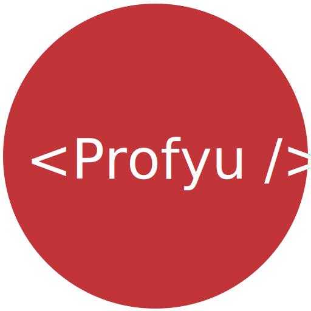
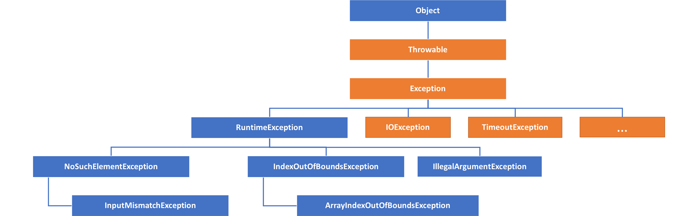

<!-- .slide: data-background="assets/background.png" -->

## 認識受檢例外 (Checked Exception)

---

# 哪些例外是受檢例外

* 不滿足 `IS A RuntimeException` 的`例外`都是 `受檢例外`

---

# 哪些例外是受檢例外

---

# 受檢例外 (Checked Exception)

* 假設有一個方法`spend`，裡頭可能會擲出受檢例外`TimeoutExcpetion`

---

# 受檢例外 (Checked Exception)

* `TimeoutExcpetion`會成為方法定義的一部分:

  * 以便告訴外界呼叫`spend`時可能會擲出`TimeoutExcpetion`

---

# 受檢例外 (Checked Exception)

* 當別人呼叫`spend`時:
  * 時編譯器會強制他處理`TimeoutExcpetion`

---

# 使用受檢例外

* 好處:
 * 讓外界清楚這個方法可能會發生的例外有哪些
 * 強制外界應變處理這些受檢例外

* 時機:
 * 當外界有能力處理時

