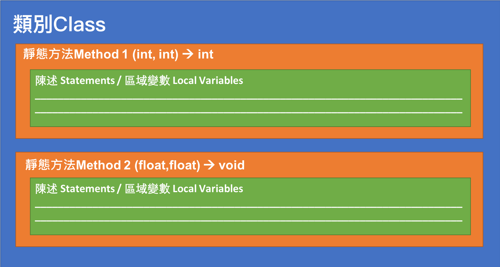
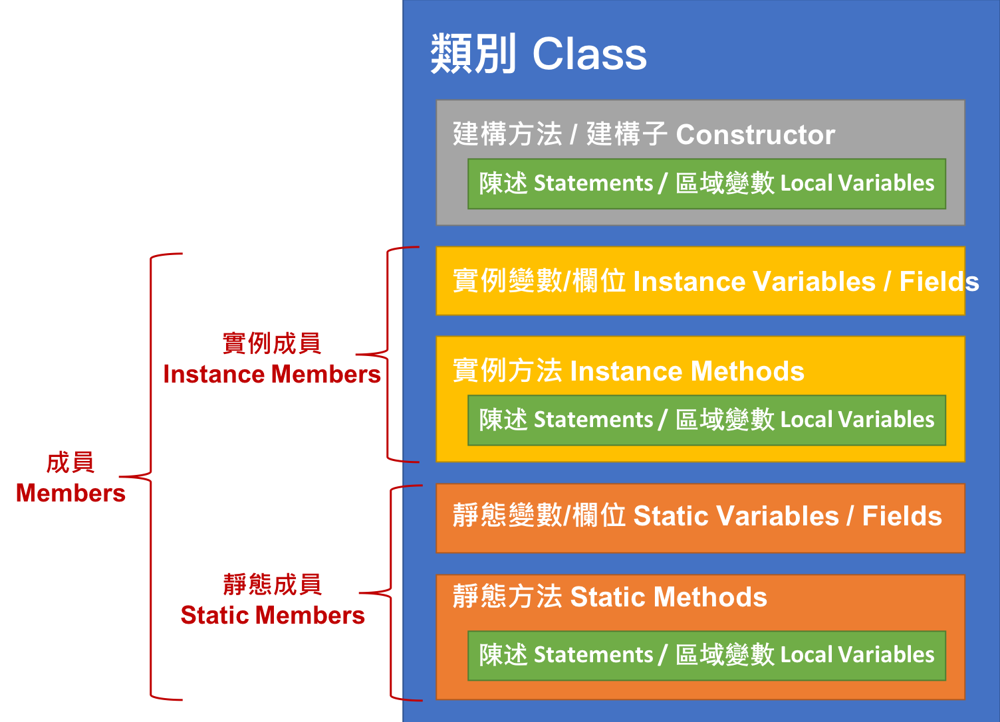
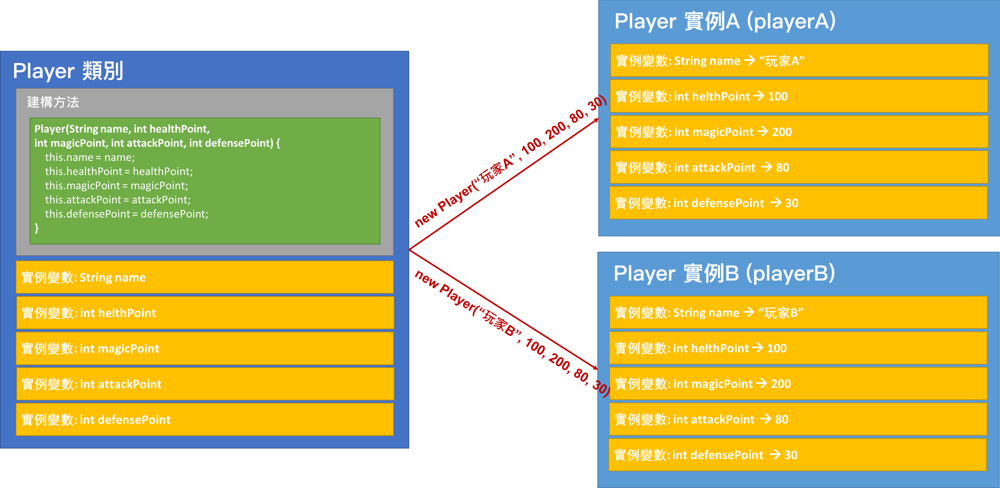
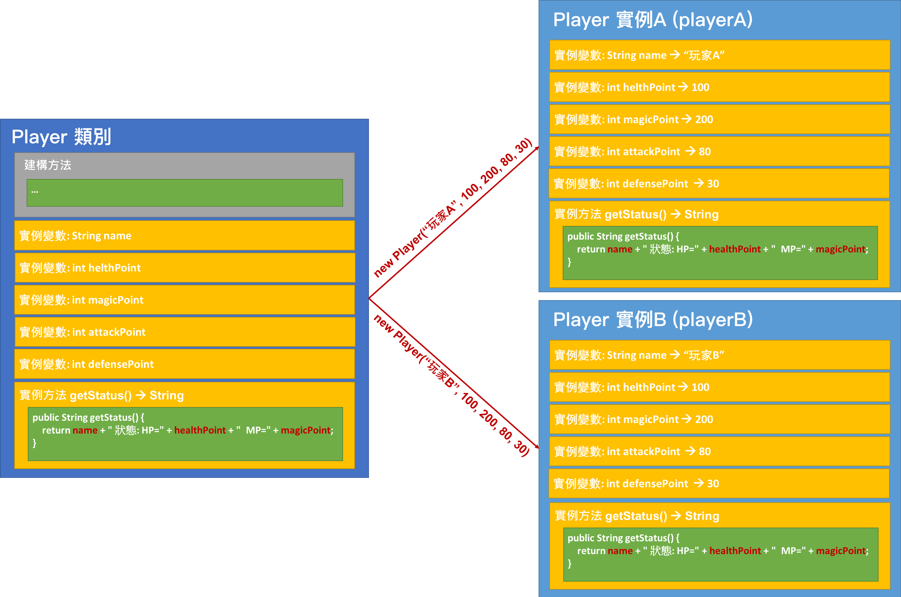
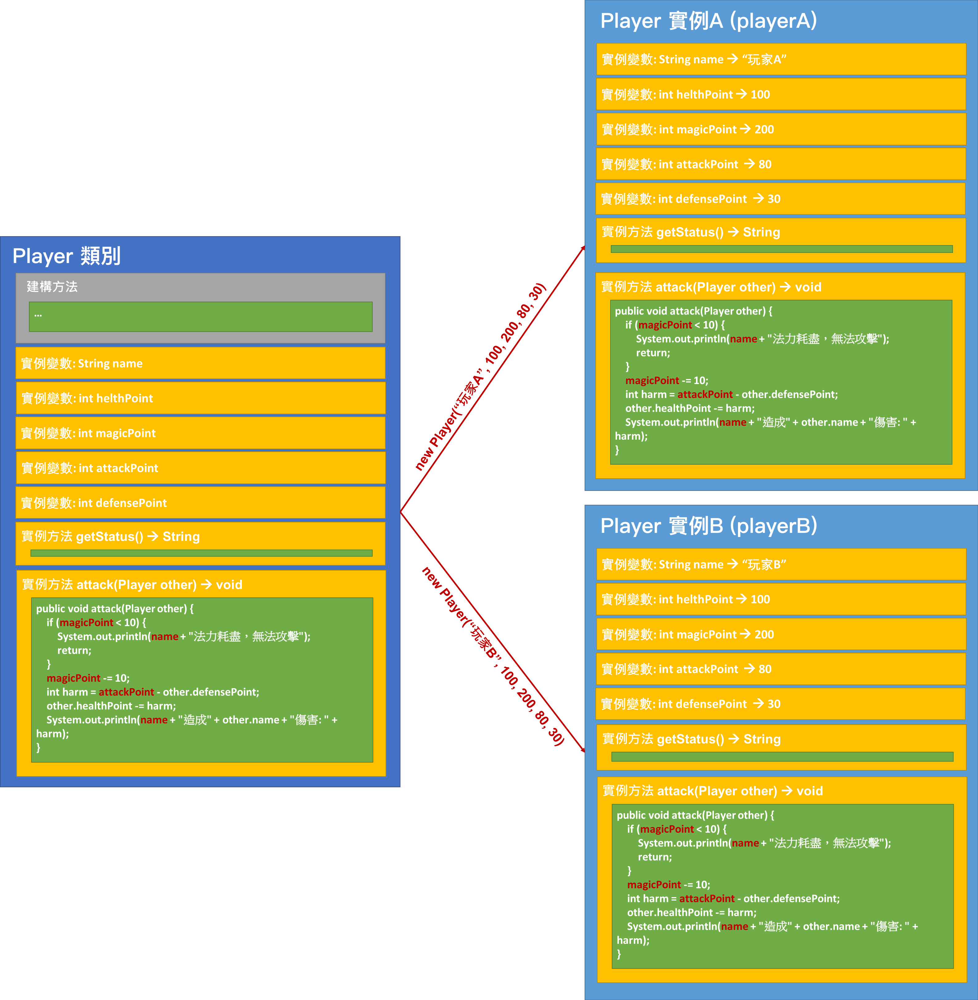
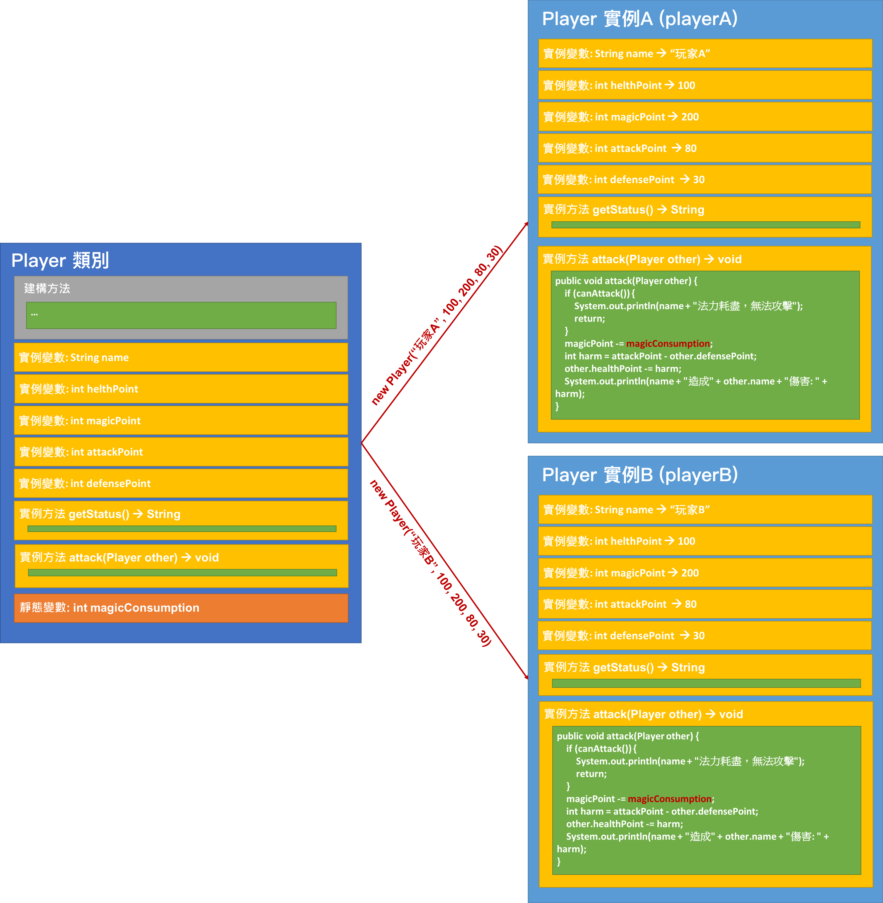

<!-- .slide: data-background="assets/background.png" -->


# 物件化導向程式設計

## 宣告類別與利用建構方法實作物件

---

# 物件化導向程式設計(OOP)

* 是一種程式設計的 `範式`
* 把程式的執行視為`物件`與`物件`之間的互動
* 好處: 靈活、易於擴充、維護

> OOP = Object-oriented programming

<!--封裝,繼承.多型.抽象-->

---

# 情境 & 思考

* 撰寫一個簡單回合制戰鬥遊戲程式
* 遊戲有兩位`玩家`
* 每位玩家都有:
  1. 名稱
  1. 生命值
  2. 法力值 (攻擊他人時要減少10)
  3. 攻擊力
  4. 防禦力

---

# 情境 & 思考

* 每回合中，兩玩家輪流攻擊對方
* 攻擊時: 對對手生命造成傷害之公式為`攻擊方攻擊力 - 受攻擊方防禦力`
* 攻擊後: 要印出雙方完整狀態(HP, MP)
* 回合直到有一方 HP 歸零，程式變結束，並印出勝敗訊息

---

# 情境 & 思考

```java
String nameA = "玩家A";
int healthPointA = 100;
int magicPointA = 200;
int attackPointA = 80;
int defensePointA = 30;

String nameB = "玩家B";
int healthPointB = 100;
int magicPointB = 200;
int attackPointB = 80;
int defensePointB = 30;
```

---

# 情境 & 思考

```java
int roundNumber = 1;
while (healthPointA > 0 && healthPointB > 0) {
    System.out.println("========== 第 " + roundNumber + " 回合 ========");

    if (roundNumber % 2 == 1) {
        if(magicPointA < 10) {
            System.out.println(nameA+"法力耗盡，無法攻擊");
            roundNumber++;
            continue;
        }
        magicPointA -= 10;
        int harm = attackPointA - defensePointB;
        healthPointB -= harm;
        System.out.println(nameA + "造成" + nameB + "傷害: " + harm);

    } else {
        if(magicPointB < 10) {
            System.out.println(nameB+"法力耗盡，無法攻擊");
            roundNumber++;
            continue;
        }
        magicPointB -= 10;
        int harm = attackPointB - defensePointA;
        healthPointA -= harm;
        System.out.println(nameB + "造成" + nameA + "傷害: " + harm);
    }
    
    System.out.println(nameA+" 狀態: HP="+healthPointA+"  MP="+magicPointA);
    System.out.println(nameB+" 狀態: HP="+healthPointB+"  MP="+magicPointB);
    
    roundNumber++;
    
}

System.out.println("========== 遊戲結束 ==========");

if(healthPointA > 0){
    System.out.println(nameA+" 獲勝!");
}
else{
    System.out.println(nameB+" 獲勝!");
}
```

---

# 情境 & 思考

* 需要一個方式把 **變數集中管理**，這方式就是透過宣告`類別`

> 當然這不是類別唯一用途

---

# 宣告玩家類別 (Class)

```java
public class Player {
	
    public String name;
    public int healthPoint;
    public int magicPoint;
    public int attackPoint;
    public int defensePoint;
}
```

> 以上宣告在類別內的變數，稱為`實例變數`或`實例欄位`

---

# 建構玩家物件/實例 (Object/Instance)

```java
Player playerA = new Player();
playerA.name = "玩家A";
playerA.healthPoint = 100;
playerA.magicPoint = 200;
playerA.attackPoint = 80;
playerA.defensePoint = 30;

Player playerB = new Player();
playerB.name = "玩家B";
playerB.healthPoint = 100;
playerB.magicPoint = 200;
playerB.attackPoint = 80;
playerB.defensePoint = 30;
```

> 建構 (Construct) 又稱實作 (Instantiate)

---

# 玩家物件化過後

```java
int roundNumber = 1;
while (playerA.healthPoint > 0 && playerB.healthPoint > 0) {
    System.out.println("========== 第 " + roundNumber + " 回合 ========");

    if (roundNumber % 2 == 1) {

        if (playerA.magicPoint < 10) {
            System.out.println(playerA.name+"法力耗盡，無法攻擊");
            continue;
        }

        playerA.magicPoint -= 10;
        int harm = playerA.attackPoint - playerB.defensePoint;
        playerA.healthPoint -= harm;
        System.out.println(playerA.name + "造成" + playerB.name + "傷害: " + harm);

    } else {

        if (playerB.magicPoint < 10) {
            System.out.println(playerB.name+"法力耗盡，無法攻擊");
            continue;
        }

        playerB.magicPoint -= 10;
        int harm = playerB.attackPoint - playerA.defensePoint;
        playerA.healthPoint -= harm;
        System.out.println(playerB.name + "造成" + playerA.name + "傷害: " + harm);
    }

    System.out.println(playerA.name + " 狀態: HP=" + playerA.healthPoint + "  MP=" + playerA.magicPoint);
    System.out.println(playerB.name + " 狀態: HP=" + playerB.healthPoint + "  MP=" + playerB.magicPoint);

    roundNumber++;

}

System.out.println("========== 遊戲結束 ==========");

if (playerA.healthPoint > 0) {
    System.out.println(playerA.name + " 獲勝!");
} else {
    System.out.println(playerB.name + " 獲勝!");
}
```


---

# 宣告建構方法(Constructor)

* 用來建立類別的`新實例`
* 類別如果沒有宣告任何建構方法，編譯器會預設加入一個`無參數的建構方法`
* 帶`參數`的話:
  1. 可以規範實例被創建時，外界該提供的資訊
  2. 參數資訊通常用來賦值進`實例變數`


> 建構方法又稱建構子

---

# 宣告建構方法(Constructor)

```java
public Player(String name, int healthPoint, int magicPoint, int attackPoint, int defensePoint) {
    this.name = name;
    this.healthPoint = healthPoint;
    this.magicPoint = magicPoint;
    this.attackPoint = attackPoint;
    this.defensePoint = defensePoint;
}
```

---

# 呼叫建構方法

```java
Player playerA = new Player("玩家A",100,200,80,30);
Player playerB = new Player("玩家B",100,200,80,30);
```

---

# 回顧

<div style="height: 30rem;">

</div>

---

# 物件化導向程式設計 - 類別

<div style="height: 40rem;">

</div>

---

# 實例變數

* `實例變數`隸屬於每個實例

<div style="height: 40rem;">

</div>

---

# 宣告實例方法

* 在實例方法內可以操作其他`實例成員`

```java
public String getStatus() {
    return name + " 狀態: HP=" + healthPoint + "  MP=" + magicPoint;
}
```

---

# 呼叫實例方法

* 實例方法隸屬於`每個實例`

```java
System.out.println(playerA.getStatus());
System.out.println(playerB.getStatus());
```

---

# 實例方法

<div style="height: 40rem;">

</div>

---

# 把攻擊行為變成實例方法

* 回傳值宣告為`void`

```java
public void attack(Player other) {
    if (magicPoint < 10) {
        System.out.println(name + "法力耗盡，無法攻擊");
        return;
    }
    magicPoint -= 10;
    int harm = attackPoint - other.defensePoint;
    other.healthPoint -= harm;
    System.out.println(name + "造成" + other.name + "傷害: " + harm);
}
```

---

# 把攻擊行為變成實例方法

* 呼叫

```java
if (roundNumber % 2 == 1) {
    playerA.attack(playerB);
} else {
    playerB.attack(playerA);
}
```

---

<div style="height: 55rem;">

</div>

---

# 把判斷是否存活變成實例方法

* 回傳值宣告為`boolean`

```java
public boolean isAlive(){
    return healthPoint > 0;
}
```

---

# 把判斷是否存活變成實例方法

```java
while (playerA.isAlive() && playerB.isAlive()) {
    // ...
}
```

```java
if (playerA.isAlive()) {
    System.out.println(playerA.name + " 獲勝!");
} else {
    System.out.println(playerB.name + " 獲勝!");
}
```

---

# 把判斷是否還能攻擊變成實例方法

---

# 物件化導向程式設計 - 類別

<div style="height: 40rem;">

</div>

---

# 靜態變數

* 靜態變數隸屬於`類別`
* 使用時: `類別名.變數名`

---

# 把固定法力消耗值宣告為靜態變數


```java
public static int magicConsumption = 10; 
```

---

<div style="height: 55rem;">

</div>


---

# 把固定法力消耗值宣告為靜態常數

```
public static final int MAGIC_CONSUMPTION = 10; 
```
