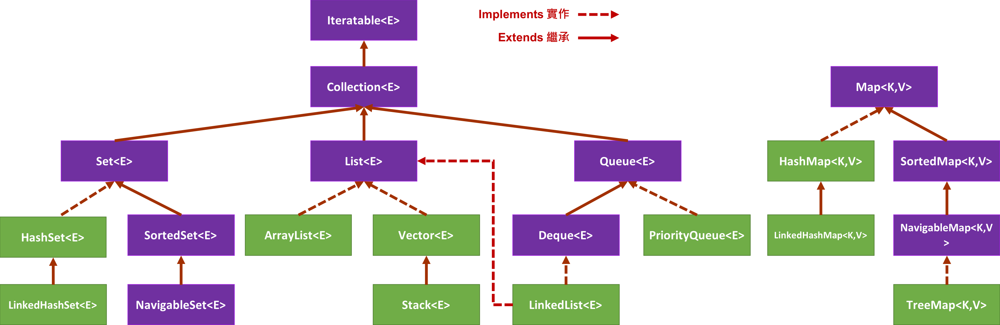

<!-- .slide: data-background="assets/background.png" -->


# Java 集合介面簡介

---

# Java 的集合種類
## `List`, `Set`, `Map`, `Queue`

---



---

# Collection&lt;E&gt; 介面

* `boolean add(E e)`
* `boolean remove(E e)`
* `int size()`
* `boolean contains(E e)`
* `void clear()`

---

# Iteratable&lt;E&gt; 介面

* `Iterator<E> iterator()`

---

# Iterator&lt;E&gt; 介面

* `boolean hasNext()`
* `E next()`

---

# List&lt;E&gt; 介面

* `E get(int index)`
* `void add(E index, E element)`
* `void set(int index, E element)`
* `E remove(int index)`

---

# Set&lt;E&gt; 介面

* `boolean add(E e)`
* `boolean remove(E e)`
* `int size()`
* `boolean contains(E e)`
* `void clear()`

> 和 Collection 介面幾乎重複，但內含仍有不同


---

# Map&lt;K,V&gt;

* `V put(K key, V vlaue)`
* `boolean containsKey(K key)`
* `Set<Entry<K,V>> entrySet()`

---

# 隱藏實作細節

```java
ArrayList<String> names = new ArrayList<>();
```

---

# 抽象一些 
## 假設更後面的陳述，需要用到索引來操作此集合

```
List<String> names = new ArrayList<>();
```

---

# 再抽象一些 
## 假設更後面的陳述，不需要用到索引來操作此集合

```
Collection<String> names = new ArrayList<>();
```


