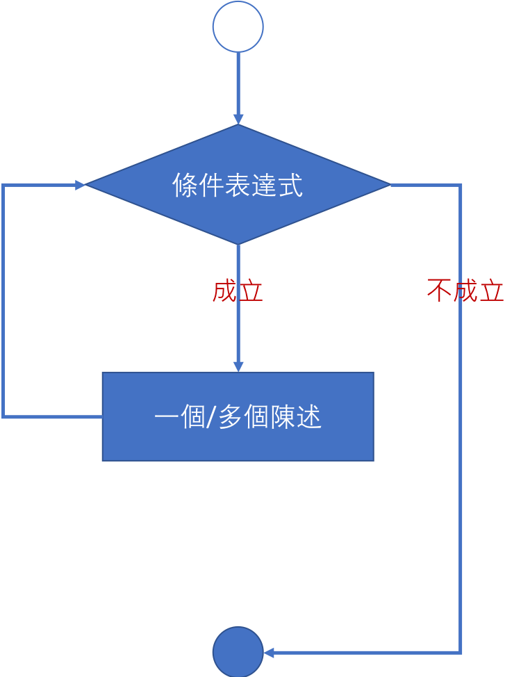
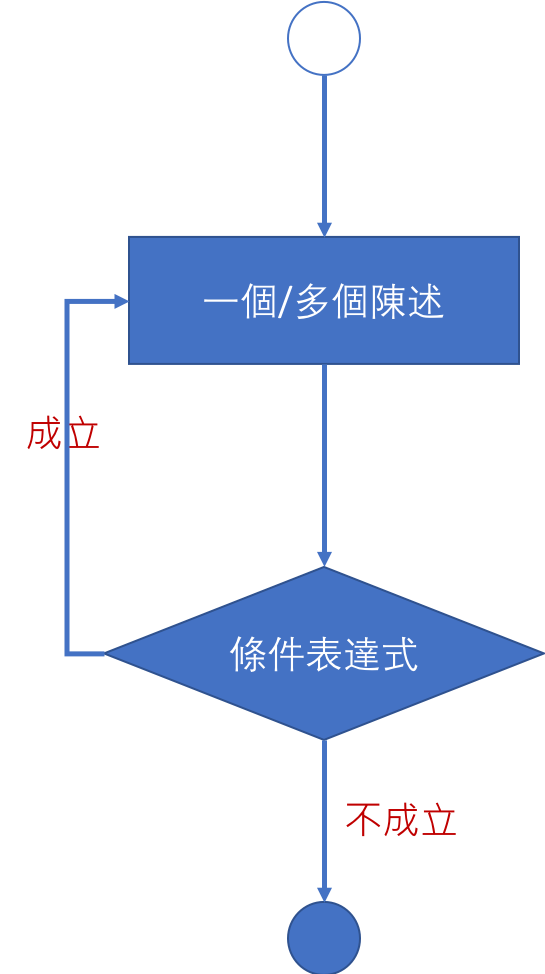

<!-- .slide: data-background="assets/background.png" -->


# 控制結構
## 迴圈結構: 透過 do-while 來控制程式執行

---

# 回顧 while 結構的兩個極端

1. `當條件表達式不可能成立時：不執行`
2. 當條件表達式恆成立時：永遠不斷重複(無限迴圈)

---

# 回顧 while 執行流程

<div style="height: 40rem;">

</div>

> while 是『前測型』迴圈

---

# do-while 執行流程

<div style="height: 40rem;">

</div>

> do-while 是『後測型』迴圈

---

# 用 do-while 來寫出不斷詢問的程式

* 寫出一個能夠不斷詢問身高的程式

```java
public static void main(String[] args) {
    Scanner sc = new Scanner(System.in);
    System.out.println("請輸入身高:");
    int height = sc.nextInt();
    System.out.println("你的身高是" + height + "公分");
}
```
<!--ATM 例子-->

---

# 用 do-while 來寫出不斷詢問的程式

```java
do {
    System.out.println("請輸入身高:");
    int height = sc.nextInt();
    System.out.println("你的身高是 " + height + " 公分");

} while (true);
```

