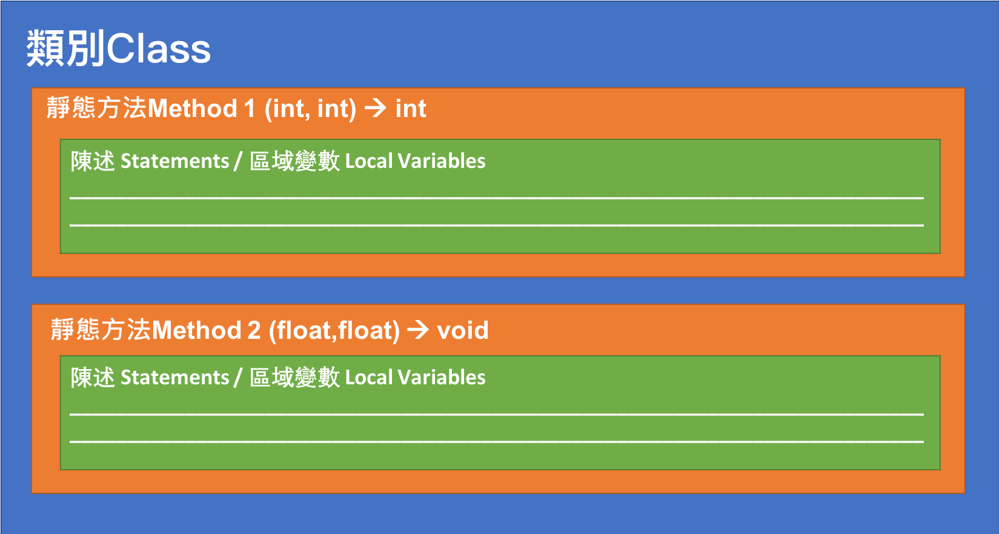

<!-- .slide: data-background="assets/background.png" -->

## 淺談封裝效益與文件查找 (以Math 為例)

---

# 封裝 (Encapsulation)

* 宣告方法的人，把方法`封裝`進類別
* 呼叫方法的人，就不用去了解實際的執行過程和區域變數狀態

---

# 封裝

> 注意:Package 內的東西不僅只有類別

---

# 這麼多套件/類別/方法我該如何使用

* 對宣告者而言: 製作API文件
* 對呼叫者而言: `查找API文件`

> API = Application Programming Interface

---

# Java SE 8 API 文件入口

* 關鍵字: `java se 8 api doc`
* 網址: `https://docs.oracle.com/javase/8/docs/api/`

---

# 先知道 Class 名稱

* 關鍵字: `java XXX class api doc`