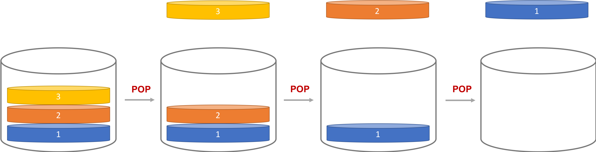
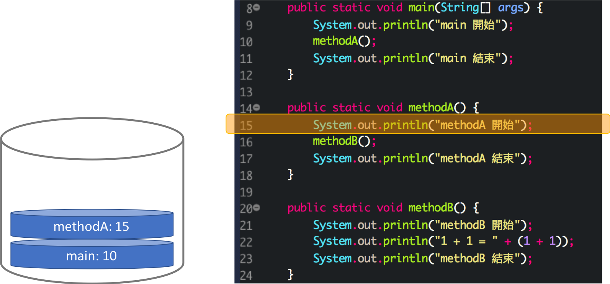

<!-- .slide: data-background="assets/background.png" -->

## 認識 Call Stack 與 Java 的例外傳遞機制

---

# Stack (堆疊) 資料結構

* 放資料進入堆疊： PUSH
* 從堆疊拿一筆資料： POP

---

# Stack (堆疊) 資料結構

> 先進後出

---

# 程式範例

---

# Call Stack

* 用堆疊結構來紀錄`方法呼叫`的過程

> 程式執行的狀態

---

# Call Stack

---

# Call Stack

---

# Call Stack

---

# Call Stack

---

# Call Stack

---

# Call Stack

---

# Call Stack

---

# Call Stack

---

# Call Stack

---

# Call Stack

---

# Call Stack

---

# Call Stack

---

# 情境 & 思考

* 故意讓 `methodB` 執行 `1 / 0` 的任務

> 為什麼有例外程式就停了?

---

# 例外一旦擲出後
## 會沿著Call Stack 往回傳遞，直到:

1. 整條Call Stack 都沒方法要捕捉: 程式就停止
2. Call Stack上有某方法捕捉到: 就做`catch`區塊內的事

---

# 例外傳遞

---

# 在 methodB 捕捉

---

# 在 methodA 捕捉

---

# 在 main 捕捉