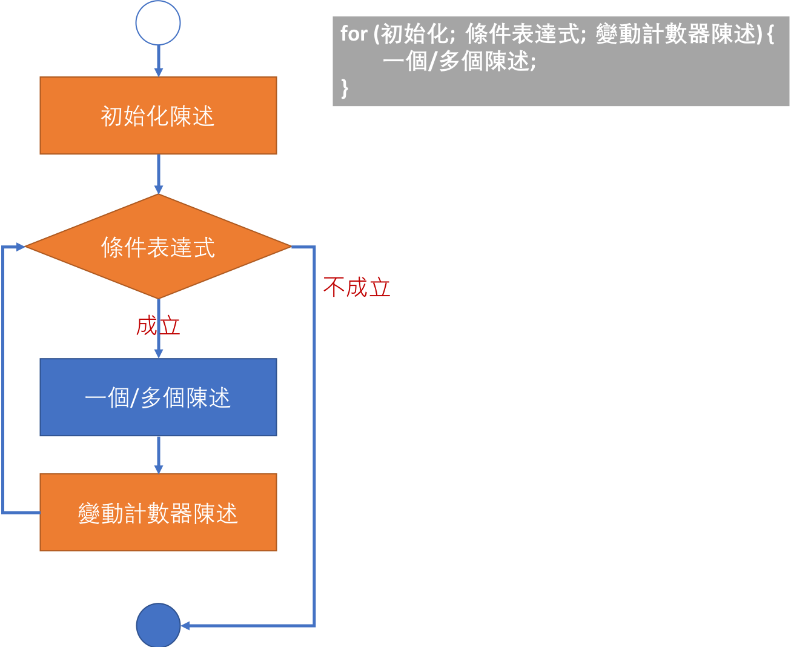

<!-- .slide: data-background="assets/background.png" -->


# 控制結構
## 迴圈結構: 透過 for 來控制程式執行

---

# 分析『計數器』模式

```java
int n = sc.nextInt();  // 1.執行迴圈之前就知道總次數
int i = 0;             // 2.計數器初始化
while(i < n){          // 3.條件與計數器有關
    System.out.println("Hello World");
    i++;               // 4.變動計數器(意圖使下次條件判斷時，有可能讓條件不成立)
}
```

---

# for 迴圈

* 如果是符合計數器模式，則使用`for`迴圈更適合

<!--講解非計數器模式的例子應用while-->

---

# for 迴圈流程&語法

<div style="height: 40rem;">

</div>

---

# 用 for 迴圈改寫

```java
int n = sc.nextInt(); 
for (int i = 0; i < n; i++) {
    System.out.println("Hello World");
}
```

