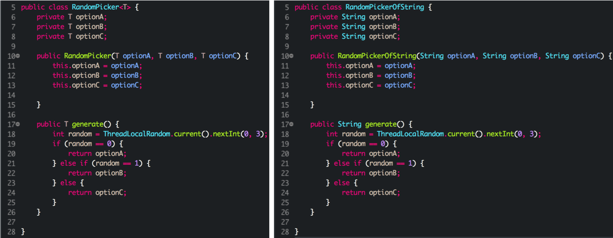

<!-- .slide: data-background="assets/background.png" -->


# 宣告並使用泛型類別

---

# 泛型類別 = 模板類別

```java
public class RandomPicker {
	private ▒▒▒▒▒▒ optionA;
	private ▒▒▒▒▒▒ optionB;
	private ▒▒▒▒▒▒ optionC;

	public RandomPicker(▒▒▒▒▒▒ optionA, ▒▒▒▒▒▒ optionB, ▒▒▒▒▒▒ optionC) {
		this.optionA = optionA;
		this.optionB = optionB;
		this.optionC = optionC;
	}

	public ▒▒▒▒▒▒ generate() {
		 int rand = ThreadLocalRandom.current().nextInt(0, 3);
		 if(random == 0){
			 return optionA;
		 }else if(random == 1){
			 return optionB;
		 }
		 else{
			 return optionC;
		 }
	}

}
```

---

## 宣告泛型類別

```java
public class RandomPicker<T> {
	private T optionA;
	private T optionB;
	private T optionC;

	public RandomPicker(T optionA, T optionB, T optionC) {
		this.optionA = optionA;
		this.optionB = optionB;
		this.optionC = optionC;
	}

	public T generate() {
		 int rand = ThreadLocalRandom.current().nextInt(0, 3);
		 if(random == 0){
			 return optionA;
		 }else if(random == 1){
			 return optionB;
		 }
		 else{
			 return optionC;
		 }
	}

}
```

> 代表未知型別的 T 又稱為型別參數

---

# 挖空的地方，何時填上?
## 答案是: 要使用的時候!

<!--舉例填表單-->

---

# 使用泛型類別

```java
RandomPicker<String> dinnerPicker = new RandomPicker<String>("滷肉飯", "雞肉飯", "鵝肉飯");
String dinner = dinnerPicker.generate();
System.out.println("今天要吃: " + dinner);
```

---

# 使用泛型類別

* `RandomPicker<String>` 可視為一個 `Class` 的名字
* `RandomPicker<String>` 類別是`編譯器`幫你`套版`臨時做出來的

---

# 型別擦除 (Type Erasure)
## 編譯器臨場套版的動作

---

# 型別擦除 (Type Erasure)



---

# 泛型類別的`型別參數`可以有多個

```java
public MyClass<T,U>{
	private T fieldA;
	private U fieldB;
}
```

---

## 在編譯器可推斷型別參數的情況下
### 可省略型別參數

