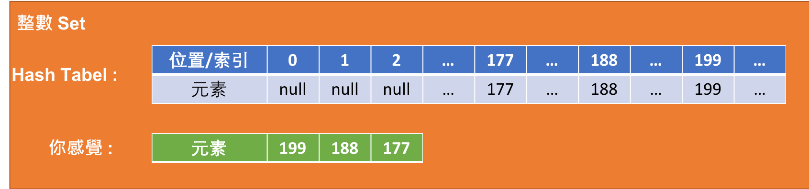

<!-- .slide: data-background="assets/background.png" -->

# Java 集合: Set
# 認識 HashSet 類別

---

# Java 的集合 (Collection) 種類
## `List`, `Set`, `Map`, `Queue`

---

# 情境 & 思考 
* 設計一程式，宣告一`ArrayList`用來紀錄一些號碼
* 程式會不斷重複請使用者輸入`指令`
* 假設使用者輸入 `add 177` 指令，代表使用者想添加一筆177的號碼
* 每一條指令做完後，都要印出 `ArrayList` 現況。

---

# 注意

* 如果使用者欲加入的號碼原先就存在於 `ArrayList` 中了，則不用理會`add` 指令

---

# ArrayList 以索引找元素很有效率

> 單位時間複雜度

---

1. 辨別元素`存在性`
2. 以元素回推索引

# `ArrayList` 比較沒效率

> 線性時間複雜度

---

# 空間換取時間

---

# HashSet

* 適合用於
  * 不在乎加入順序 (無序)
  * 元素不得重複
  * 對於辨識元素`存在性`要求高效率
  * 對於`加入元素`要求高效率
  * 對於`刪除元素`要求高效率

---

# 情境 & 思考

* 刪除指令: `remove 188`
  * 代表要刪除 `188` 這個元素 

---

# 情境 & 思考

* 檢驗存在性指令: `contains 188`
  * 表示判斷是否 `188` 是否在集合中，印出 `true` 或 `false`