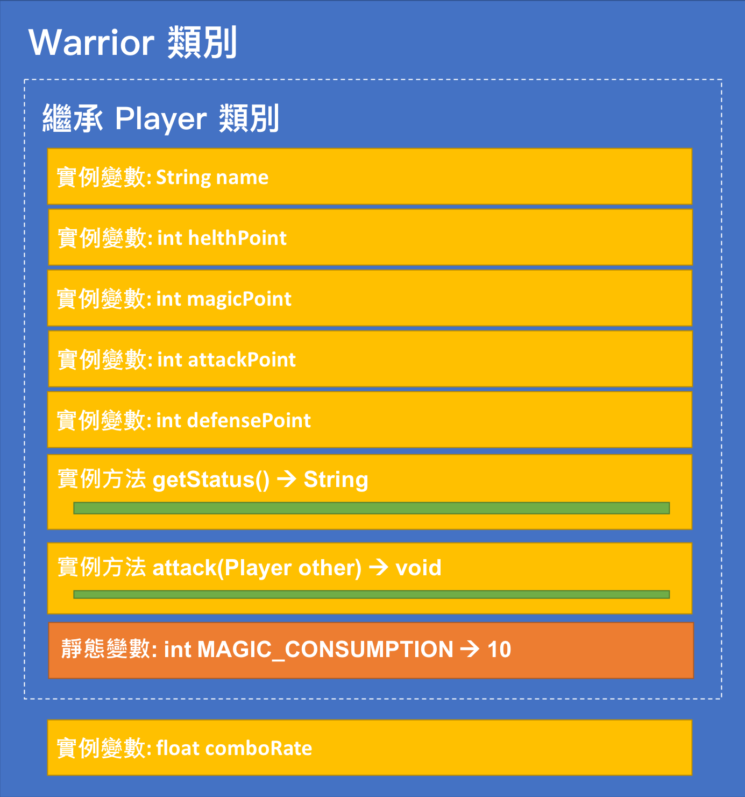
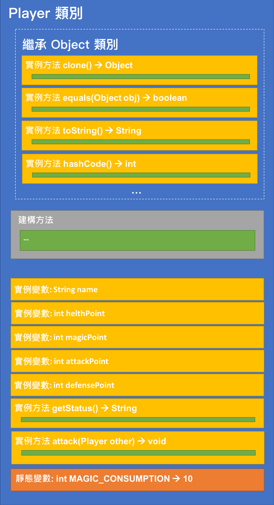
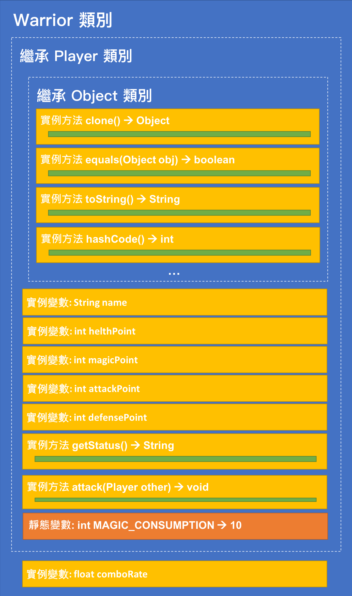

<!-- .slide: data-background="assets/background.png" -->


## 認識如何繼承類別

---

# 情境 & 思考

* 先刪除`Player` 的第二個建構方法 (簡化)

---

# 情境 & 思考

* 宣告一個 `Warrior` 類別
* `Warrior` 類別擁有`Player`類別一模一樣的實例成員
* 但是，`Warrior` 類別多了一個 `comboRate` (連擊機率) 實例變數

---

# 繼承 Inheritance

* 表示某個類別直接擁有另一類別的`成員`
* 繼承他人的類別稱為`子類別` (Subclass / Child Class) 
* 被繼承的類別成稱為`父類別` (Superclass, Parent Class)


---

# 讓 Warrior 繼承自 Player

```java
public class Warrior extends Player {

	private float comboRate;

	public float getComboRate() {
		return comboRate;
	}

	public void setComboRate(float comboRate) {
		this.comboRate = comboRate;
	}

}
```

---

# 讓 Warrior 繼承自 Player

* 好處: 讓子類別在父類別既有的基礎上，進行擴充

---

# 繼承示意圖

<div style="height: 40rem;">

</div>

> 省略 getter, setter

---

# 建構方法沒有被繼承

* 由於`建構方法`不算是成員，因此`父類別建構方法`沒有被繼承下來
* 雖然沒被繼承，但是`父類別建構方法`可以被`子類別建構方法`呼叫

---

# 子類別的建構方法

* **第一個陳述**一定要是以下兩者擇一:
  1. 呼叫父類別的建構方法
  2. 呼叫自己類別的其他建構方法

---

# Warrior 類別的建構方法

*  要比原來 `Player` 多一個參數 `comboRate`

```java
public class Warrior extends Player {

	private float comboRate;
	public Warrior(String name, int healthPoint, int magicPoint, int attackPoint, int defensePoint,float comboRate) {
		super(name, healthPoint, magicPoint, attackPoint, defensePoint);
		this.comboRate = comboRate;
	}	
}
```

---

# Object 類別

* 是所有 Java 類別的`最頂層`父類別
* 宣告類別時，若沒有表明要繼承哪個父類別:
  * 則編譯器自動幫該類別繼承`Object`類別
* `Object` 類別 **沒有父類別**

---

# 繼承關係圖

```txt
java.lang.Object
    com.example.playground.Player
        com.example.playground.Warrior
```

---

# String 類別繼承關係

---

# Scanner 類別繼承關係

---

# Player 真正的成員結構

<div style="height: 45rem;">

</div>

---

# Warrior 真正的成員結構

<div style="height: 45rem;">

</div>


---

# 既然 Player 是 Object 的子類別

```txt
子類別建構方法第一個陳述，一定要是以下兩者擇一:
  1. 呼叫父類別的建構方法
  2. 呼叫自己類別的其他建構方法
```

> 我們當初沒有這樣，也沒事啊？

---

# Java 不允許多重繼承

* 亦即，每個類別只能繼承自`一個`父類別