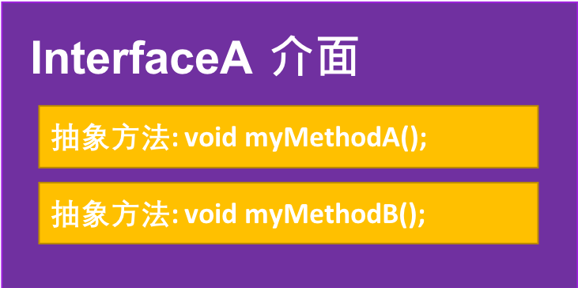
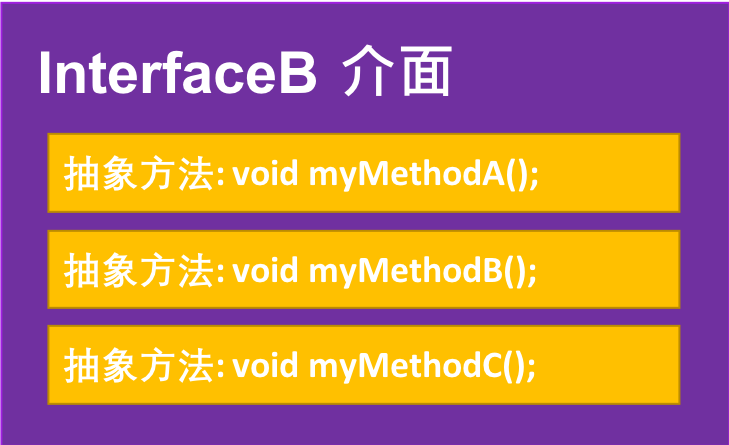
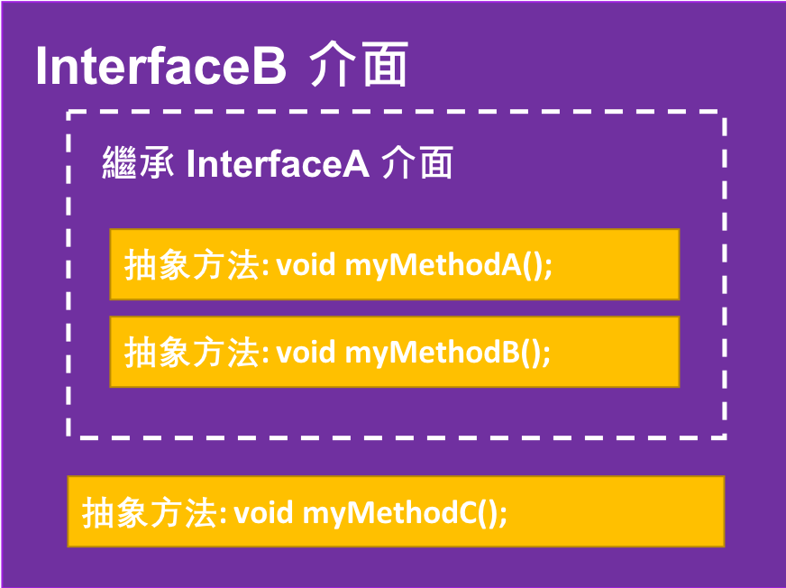

<!-- .slide: data-background="assets/background.png" -->


## 介面的繼承

---

# 介面繼承

* 如同一個`類別`可以繼承另一個`類別`一般:
  * 一個`介面`可以繼承另一個`介面`

---

<div style="height: 20rem;">

</div>

---

<div style="height: 25rem;">

</div>

---

## 讓 InterfaceB 繼承 InterfaceA 的公約內容
# 也就是繼承 `抽象方法`

---

<div style="height: 25rem;">

</div>

```java
public interface InterfaceA {
	public void myMethodA();
    public void myMethodB();
}
```

```java
public interface InterfaceB extends InterfaceA {
	public void myMethodC();
}
```

---

# 實作 InterfaceB

```java
public class MyClass implements InterfaceB {
    @Override
	public void myMethodA() {
        // 實作 myMethodA 於此
	}
    @Override
	public void myMethodB() {
        // 實作 myMethodB 於此
	}
    @Override
	public void myMethodC() {
        // 實作 myMethodC 於此
	}
}
```

---

# MyClass 實例的多型

```java
MyClass a = new MyClass();
Object a1 = a; // 因類別繼承而得的多型 (a IS A Object)
InterfaceB  a2 = a; // 因實作介面而得的多型 (a IS A InterfaceB)
InterfaceA a3 = a; // 因實作介面而得的多型 (a IS A InterfaceA)
```

---

# 介面`可以`多重繼承

* 一個介面可以同時繼承多個父介面

> 但類別的繼承不可

---

# 介面多重繼承

```java
public interface InterfaceA {
	public void myMethodA();
    public void myMethodB();
}
```
```java
public interface InterfaceK {
	public void myMethodK();
}
```

```java
public interface InterfaceB extends InterfaceA, InterfaceK {
	public void myMethodC();
}
```

---

# MyClass 要實作哪些方法？

```java
public class MyClass implements InterfaceB {
    
    // MyClass 要實作哪些方法？

}
```

---

# 全部都要!

```java
public class MyClass implements InterfaceB {
    @Override
	public void myMethodA() {
        // 實作 myMethodA 於此
	}
    @Override
	public void myMethodB() {
        // 實作 myMethodB 於此
	}
    @Override
	public void myMethodK() {
        // 實作 myMethodK 於此
	}
    @Override
	public void myMethodC() {
        // 實作 myMethodC 於此
	}
}
```