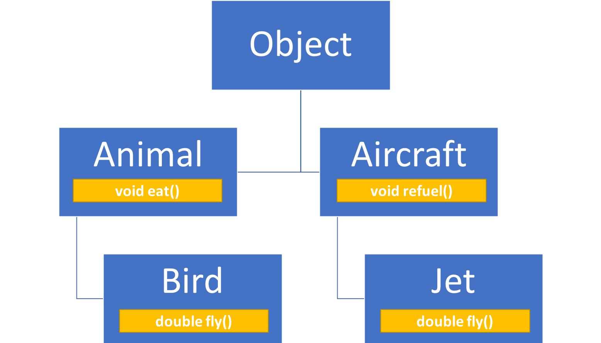

<!-- .slide: data-background="assets/background.png" -->


## 宣告並實作介面

---

# 介面: 程式語言裡面的公約

* 公約上約定一系列的`抽象方法`
* 這份公約是讓想遵守的 `類別` 來遵守的
  * 願意遵守這份公約的`類別`，要 **實作出介面上載明的所有抽象方法**

---

# 情境 & 思考

* 爪哇國是一個萬物都擬人化的國度
* 爪哇國內，有種`鳥類`居民:

```java
public class Animal {
	public void eat() {
		System.out.println("身為動物，我要吃食物");
	}
}
```

```java
public class Bird extends Animal {
	public double fly() {
		return 1000d + Math.random();
	}
}
```

---

# 情境 & 思考

* 爪哇國內，有種`噴射機類`居民

```java
public class Aircraft {
	public void refuel(){
		System.out.println("身為飛行器，我要加油");
	}
}
```

```java
public class Jet extends Aircraft {
	public double fly() {
		return 11000 + Math.random();
	}
}
```

---

# 情境 & 思考



---

# 情境 & 思考

* 爪哇國內，居住有 `2 隻`鳥實例、 `1 台`噴射機實例
* 爪哇國去年舉辦 **第一屆鳥類飛高大賽**
  * 參賽的鳥要放進一個`陣列`內排隊
  * 依排隊順序各飛一次
  * 飛最高的鳥獲勝

---

# 情境 & 思考

```java
public static void main(String[] args) {

    // 爪哇國居民們
    Bird birdA = new Bird();
    Bird birdB = new Bird();
    Jet jetC = new Jet();

    // 參賽者排隊陣列
    Bird[] participants = new Bird[] { birdA, birdB };
    
    // 開始比賽
    int winnerIndex = -1;
    double winnerHeight = Double.MIN_VALUE;
    
    for(int i=0;i<participants.length;i++){
        Bird participant = participants[i];
        double height = participant.fly();
        if(height > winnerHeight){
            winnerIndex = i;
            winnerHeight = height;
        }
    }
    
    // 公布結果
    System.out.println("索引 " +winnerIndex+" 的參賽者以高度 "+winnerHeight+"公尺 獲勝！");

}
```

---

# 情境 & 思考

* 從今年開始，爪哇國要舉辦`第一屆萬物飛高大賽`
* 程式怎麼改?
  * 讓 Jet 繼承 Bird?
  * 排隊陣列放寬成 `Object[]`?

---

# 宣告介面: Flyable

* 立下一份公約，上面規定願意遵守公約的`類別` **一定要會飛**
* 只要會飛就好，介面不管遵守此公約的`類別` 要如何飛

```java
public interface Flyable {
	public float fly();
}
```

---

# Bird 類別願意遵守 Flyable 公約

* 願意遵守的類別，就要來 `實作Flayble介面`
* 也就是`實作介面上的所有抽象方法`

```java
public class Bird extends Animal implements Flyable {
	
	@Override
	public double fly() {
		return 1000d + Math.random();
	}
}
```
<!--Demo 若不遵守會出錯-->

---

# Jet 類別願意遵守 Flyable 公約

```java
public class Jet extends Aircraft implements Flyable {

    @Override
	public double fly() {
		return 11000 + Math.random();
	}
}
```

---

# 遵守公約有什麼好處?

---

# 介面其實也是一種型別

* 願意遵守 `Flyable` 介面的類別，其建構出的實例就能滿足 `IS A Flyable` 的關係

---

# 介面其實也是一種型別

```java
public static void main(String[] args) {

    // 爪哇國居民們
    Bird birdA = new Bird();
    Bird birdB = new Bird();
    Jet jetC = new Jet();

    // 參賽者排隊陣列
    Flyable[] participants = new Flyable[] { birdA, birdB, jetC };
    
    // 開始比賽
    int winnerIndex = -1;
    double winnerHeight = Double.MIN_VALUE;
    
    for(int i=0;i<participants.length;i++){
        Flyable participant = participants[i];
        double height = participant.fly();
        if(height > winnerHeight){
            winnerIndex = i;
            winnerHeight = height;
        }
    }
    
    // 公布結果
    System.out.println("索引 " +winnerIndex+" 的參賽者以高度 "+winnerHeight+"公尺 獲勝！");

}
```

---

# 多型的成因

* 透過類別繼承關係:
  * `birdA` IS A `Bird`
  * `birdA` IS A `Animal`
  * `birdA` IS A `Object`
* 透過介面實作:
  * `birdA` IS A `Flyable`

---

```java
// 爪哇國居民們
Flyable birdA = new Bird();
Flyable birdB = new Bird();
Flyable jetC = new Jet();
```

---

# 一個類別可以實作多個介面

* 亦即同時遵守多個公約
* 所有介面內的所有抽象方法，都要實作完成才行

> 實作越多介面，`IS A`的關係越多

---

# 介面`不可`用來建構出物件

```java
// 錯誤: 意圖拿介面來建構實例
Flyable something = new Flyable( ... ); 
```

```java
// 建構匿名類別的實例
Flyable something = new Flyable{ ... }; 
```


> 抽象類別也不可用來建構出物件