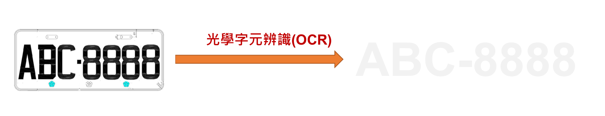
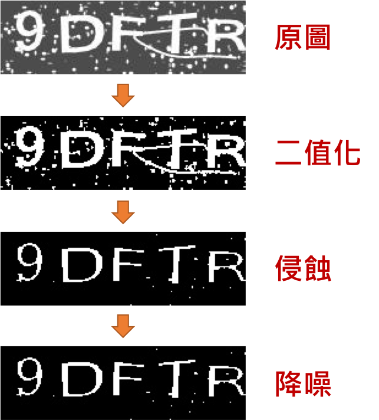
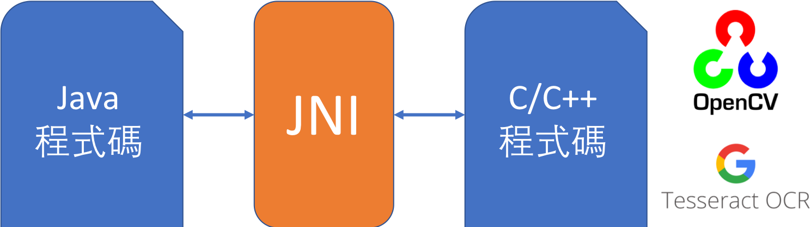
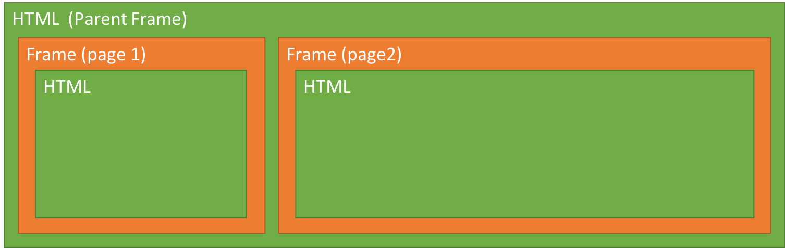
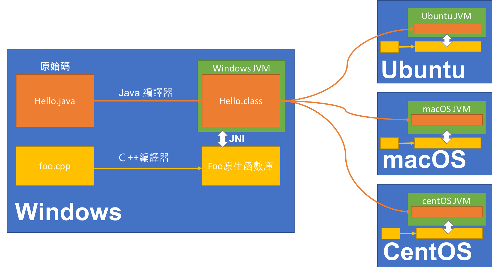

---
title:
theme: profyu
---

<!-- .slide: data-background="assets/background.png" -->


# 直播專題
## Java的自動化爬蟲與驗證碼(Captcha)解析

---

# [證交所](http://bsr.twse.com.tw/bshtm/)
# 個股買賣日報表抓取

---

# 光學字元辨識
### Optical Character Recognition, OCR



---

# [Tesseract OCR](https://github.com/tesseract-ocr/tesseract)

---

# 影像前置處理

<div style="height: 40rem;">

</div>

---

# [OpenCV](https://opencv.org/)

---

# JNI
## Java Native Interface



---

# HTML Frame



---

# JNI
## 降低程式跨平台特性



---

# [JavaCPP](https://github.com/bytedeco/javacpp) & [JavaCPP Presets](https://github.com/bytedeco/javacpp-presets)

---

# 初始化 Tesseract

```txt
/var/folders/94/lvfv1hss0k95xm9gsb918t6h0000gn/T/captcha-solver-ws1969722663639896198
├── tessdata
    ├── eng.traineddata


```

---

# 影像處理
* 參考資料: [https://github.com/coldnew/twse-captcha-solver-java](https://github.com/coldnew/twse-captcha-solver-java)