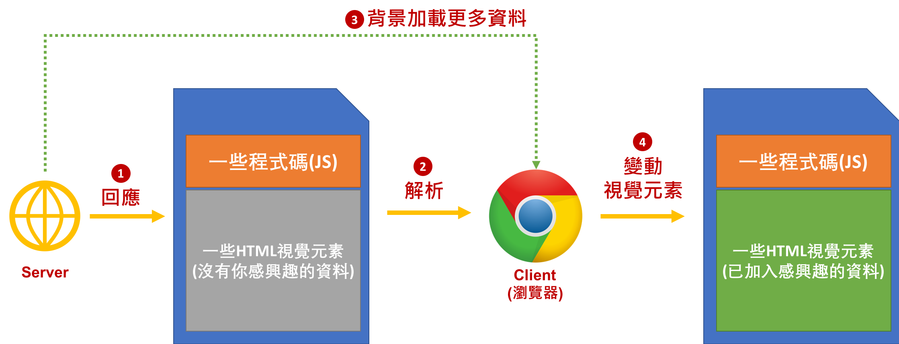

---
title:
theme: profyu
---

<!-- .slide: data-background="assets/background.png" -->


# 直播專題
## 透過 Java 實現瀏覽器自動化:
## Selenium 介紹與操作

---

# KKBOX 華語新歌日榜抓取

* 華語每日排行:  
```
https://kma.kkbox.com/charts/daily/newrelease?date=2018-06-11&lang=tc&terr=tw
```
* 給定一個`日期` (預設是今天)
* 程式自動抓回當天的`華語新歌排行`，存成`CSV`檔
* 互動: 自動播放當天榜上的曲目(試聽)


---

# Jsoup 爬蟲的限制

* 你感興趣的資料，要直接包含在Server的`回應文本`當中
* 例如: `https://mit.jobs/jobs?page=1`

---

# Jsoup 爬蟲的限制

* 回應 (節錄):

```html
<div class="job-item" id="job-7389">
  <div class="info-1">
    <div class="companyLogo">
      <a target="_blank" href="https://mit.jobs/jobs/7389-pp-%E6%95%B8%E6%93%9A%E8%B3%87%E6%96%99%E5%88%86%E6%9E%90%E5%B8%AB%E6%9F%AC%E5%9F%94%E5%AF%A8">
        <div class="logoBlock">
          
        </div>
</a>    </div>
    <div class="main-title">
      <div class="main-title-item">
        <a class="job-title" target="_blank" href="https://mit.jobs/jobs/7389-pp-%E6%95%B8%E6%93%9A%E8%B3%87%E6%96%99%E5%88%86%E6%9E%90%E5%B8%AB%E6%9F%AC%E5%9F%94%E5%AF%A8">PP-【數據資料分析師】（柬埔寨）</a>
      </div>
      <div class="main-title-item">
        <a class="job-employer" target="_blank" href="https://awesomegaming.mit.jobs/">傲勝遊戲有限公司</a>
      </div>

    </div>
  </div>
  <div class="info-2">
    <span class="pay"> 80,000 -  120,000 </span>
    <div class="paidby">
      TWD
      每月
    </div>
    <div class="hiring-bonus font-Oswald">
      <i class="fa fa-check-square-o"></i> 推薦獎金
    </div>
<!--     <div class="hiring-bonus font-Oswald">
      <i class="fa fa-check-square-o"></i> 就職獎金
    </div> -->
  </div>
  <div class="info-3 row">
    <div class="col-xs-9">
      <div class="location">
        <i class="fa fa-map-marker"></i>
        Cambodia
      </div>
      <div class="type">
        <span>Full-Time</span>
      </div>
      <p class="summary">1、需具遊戲企劃經驗至少一年以上。
2、具良好溝通能力，並對數字變化敏感。
3、曾負責兩款以上遊戲營運經驗者佳。
4、具良好邏輯思維能力，善於思考，樂於鑽研資料、使用者及產品。
5、具使...</p>

      <div class="tags">
          <a class="tag" href="https://mit.jobs/jobs?search=EXCEL&amp;utf8=%E2%9C%93">#EXCEL</a>
      </div>
    </div>
    <div class="col-xs-3 text-right">
    </div>
  </div>
</div>
```

---

# 為什麼資料不在回應文本中?

* 例如: `https://kma.kkbox.com/charts/daily/newrelease?date=2018-06-11&lang=tc&terr=tw`
  * 用瀏覽器`Inspect`工具有看到資料
  * 用 `Jsoup`撈回來卻沒看到

---

# Client Side Render

* 因為你感興趣的資料屬於 `Client Side Rendered` 的元素

<div style="height: 55rem;">

</div>

---

# Selenium

* 原本是一個自動化測試Ｗeb的工具
* 但同時也非常適合做 `Client Side Rendered 元素`的爬蟲

> Selenium automates browsers. That's it!

---

# Selenium + Java

<div style="height: 55rem;">

</div>

---

# 範例原始碼

[https://github.com/profyu/song-rank](https://github.com/profyu/song-rank)

---

# Chrome Driver 下載

* [http://chromedriver.chromium.org/downloads](http://chromedriver.chromium.org/downloads)


