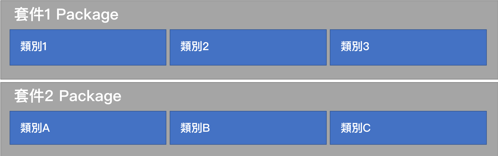

<!-- .slide: data-background="assets/background.png" -->


## 使用 Maven 進行套件管理

---

# 套件 (Package)



---

# 引用 JAR 檔


---

## JAR 檔 = 類別庫 = Library = 函數庫
# = 套件?!

---

## 引用套件聽起來很合理
# 有什麼問題？

---

## 別人也想站在巨人肩膀上


---

# 版本要小心


---

## 幸好 Maven 專案管理工具
# 早就替我們想到了

---

# Maven 專案 `pom.xml` 檔

## 當中會記載，我這個專案:
  1. 叫什麼名字?
  2. 是第幾版?
  3. 要依賴哪些套件/第幾版?

---

# 如果每個讓大家公開使用的套件
## 都是用 `Maven` 專案管理

---

1. 都有 `pom.xml`
2. 都把 `jar檔` 打包好之後，連同該`pom.xml`一起上傳到 `Maven Central Repository` 的網站上

---

# Maven 套件管理


---

# 情境 & 思考

1. 設計一程式，讓使用者輸入一個圖片的網址
2. 程式會自動把圖片下載回桌面上

---

# Apache CommonIO 套件(Library)

* FileUtils 類別

```java
static void	copyURLToFile(URL source, File destination)
```

---

# 把 pom.xml 內的 dependency 拿掉看看


