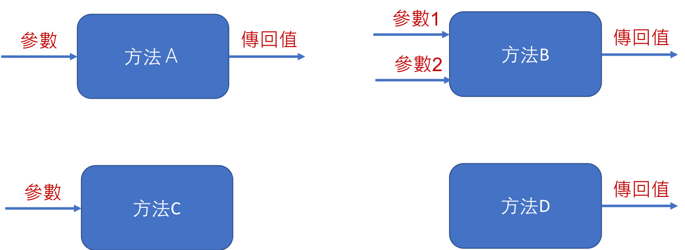

<!-- .slide: data-background="assets/background.png" -->


## 認識方法的宣告與呼叫

---

# 情境 & 思考

* 撰寫一個程式，接受使用者輸入的 `a`, `b` 兩整數，請計算印出 `a 的 b 次方`

```java
System.out.println("請輸入a: ");
int a = sc.nextInt();
System.out.println("請輸入b: ");
int b = sc.nextInt();

int result = 1;
for (int i = 0; i < b; i++) {
    result *= a;
}
System.out.println( a+" 的 "+b+" 次方是 "+result);
```

---

# 情境 & 思考

* 問題1: 次方是很常見的數學計算，我們真的希望每次要做次方計算時，都重寫一次for迴圈嗎?
* 問題2: 我寫出來的次方計算是最正確？最有效率的嗎? 

<!--問題1 不僅寫得時後麻煩，維護更麻煩-->

---

# 方法 (Method)

* `方法` 是由一些的`陳述`組成
* 每次當方法被`呼叫`時，它可能會從呼叫他的人手中獲得`參數`
* 接者這些陳述就會被執行一次，並可能給來呼叫它的人一個`傳回值`


---

# 方法 (Method)

* `方法` 是由一些`我想執行的程式碼`組成
* 每次當方法被`使用`時，它可能會從使用他的人手中獲得`輸入值`
* 接著這些我想執行的程式碼就會被執行一次，並可能給我一個`結果值`


---

# 方法 (Method)

* `方法`可讓同一段程式碼，不用重寫很多次，可以被重複執行很多次

---

# 方法呼叫示意圖



> 方法有時也被稱為函數/函式

---

# 方法的兩個階段

1. 宣告階段(定義)
2. 呼叫階段(被用)

---

# 宣告方法

* 在 `MathHelper` 類別中宣告`power`方法
```java
public static int power(int a, int b) {
    int result = 1;
    for (int i = 0; i < b; i++) {
        result *= a;
    }
    return result;
}
```

---

# 呼叫方法

* 呼叫`MathHelper` 類別中的`power`方法

```java
System.out.println( a+" 的 "+b+" 次方是 "+MathHelper.power(a, b));
```

---

# 情境 & 思考

* 站在巨人肩膀上，方法的宣告階段不一定要自己做

```java
int result = (int)Math.pow(a, b);
```

---

# 方法有兩大類

1. 靜態方法(Static Method):
  * 表示此方法隸屬於一個`類別`(Class)
  * 呼叫時，只需隨時 `類別名.方法名(...)` 即可完成呼叫

2. 實例方法(Instance Method/Object Method)
  * 表示此方法隸屬於一個`類別`所實作(new)出來的 `實例`(物件)
  * 呼叫時，要先確定某一物件對象: `物件變數.方法名(...)` 或 `物件常數.方法名(...)`


---

# 透過 void 來讓方法沒有傳回值

* 宣告

```java
public class MyClass {
    public static void sayHello(String target) {
        System.out.println("Hello " + target);
    }
}
```

* 呼叫

```java
MyClass.sayHello("World");
MyClass.sayHello("John");
```

---

# 何謂 main 方法


