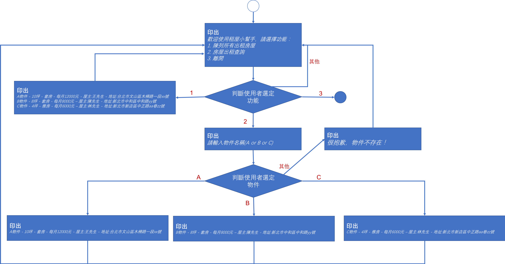

<!-- .slide: data-background="assets/background.png" -->


# 專題: 租屋小幫手
## 建構基本程式流程

---

# 開新 Maven Project

---

# 給定三間租屋物件資訊

* A物件 - 10坪 - 套房 - 每月12000元 - 屋主:王先生 - 地址:台北市文山區木柵路一段xx號
* B物件 - 8坪 - 套房 - 每月8000元 – 屋主:陳先生 - 地址:新北市中和區中和路yy號
* C物件 - 4坪 - 雅房 - 每月6000元 – 屋主:林先生 - 地址:新北市新店區中正路aa巷zz號

---

# 租屋物件資訊被宣告成以下變數

```java
// A 租屋物件資料
float areaA = 10f;
String typeA = "套房";
int priceA = 12000;
String ownerA = "王先生";
String addressA = "台北市文山區木柵路一段xx號";

// B 租屋物件資料
float areaB = 8f;
String typeB = "套房";
int priceB = 8000;
String ownerB = "陳先生";
String addressB = "新北市中和區中和路yy號";

// C 租屋物件資料
float areaC = 4f;
String typeC = "雅房";
int priceC = 6000;
String ownerC = "林先生";
String addressC = "新北市新店區中正路aa巷zz號";
```

---

# 程式流程圖

<!-- <div style="height: 40rem;"> -->

<!-- </div> -->

---

# 讓程式更加完善

* 把重複的字串資訊放入變數

---

# 讓程式更加完善

* 萬一使用者選功能時輸入的不是整數怎麼辦？

---

# Scanner 觀念

* 第一次輸入 abc 之前:
```
(空空的) 
↑
```

* 第一次輸入 abc 之後:
```
abc 
↑
```

---

# Scanner 觀念

* 在**沒有**呼叫`next...` 或者 `next`方法的情況下:
```
abc
↑
```

* 在有呼叫 `next...()` 或者 `next()`方法的情況下:
```
abc
    ↑
```