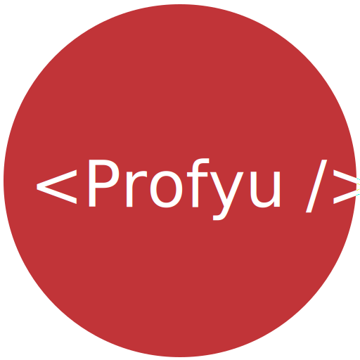

<!-- .slide: data-background="assets/background.png" -->


# 專題: 租屋小幫手
## 透過 GSON 套件序列化/反序列化租屋資料

---

# 序列化 / 反序列化
## Serialization / Deserialization

---

# 序列化 / 反序列化


---

# CSV 文本格式


---

# CSV 文本格式
## 要自己寫反序列化的邏輯
## 難以自動化

```java
// ...
String[] values = line.split(",");

float area = Float.parseFloat(values[0]);
String type = values[1];
int price = Integer.parseInt(values[2]);
String owner = values[3];
String address = values[4];

House house = new House(area, type, price, owner, address);
//...
```

---

# JSON 文本格式

```json
[
    {
        "area": 10,
        "type": "套房",
        "price": 12000,
        "owner": "王先生",
        "address": "台北市文山區木柵路一段xx號"
    },
    {
        "area": 8,
        "type": "套房",
        "price": 8000,
        "owner": "陳先生",
        "address": "新北市中和區中和路yy號"
    },
    {
        "area": 4,
        "type": "雅房",
        "price": 6000,
        "owner": "林先生",
        "address": "新北市新店區中正路aa巷zz號"
    }
]
```

---

# Gson

## 由Google 提供的 JSON 序列化/反序列化套件

---

## 租屋資料爬回來後
# 將資料序列化成 JSON 檔保存