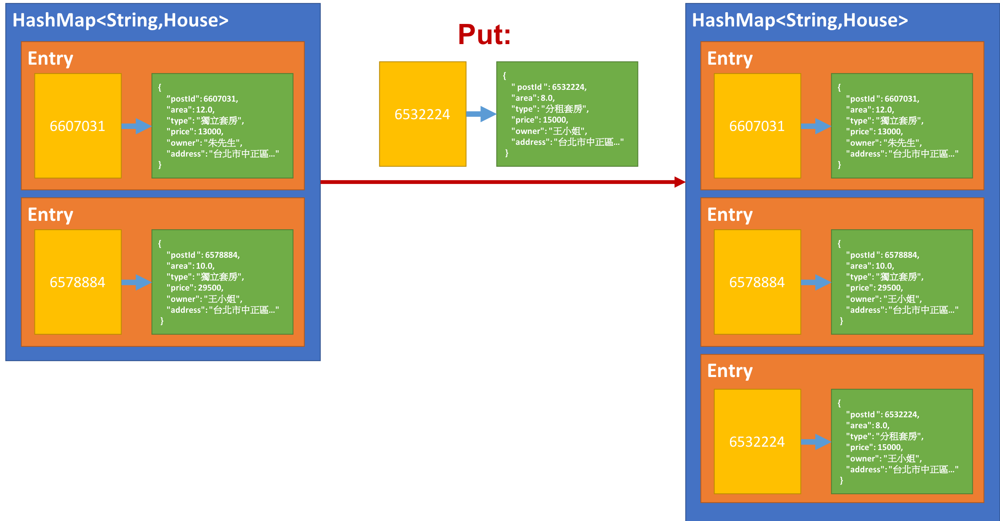
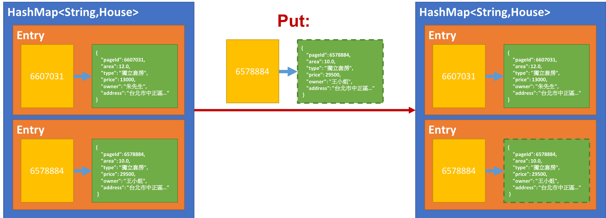

<!-- .slide: data-background="assets/background.png" -->


# 專題: 租屋小幫手
## 爬回更豐富的租屋網資料

---

# 問題回顧

* 目前租屋小幫手，會有存放`重複資料`的問題

---

# 抓回`頁面編號`
## 以解決重複抓取的問題

---

## 把 `ArrayList<House>` 集合
# 換成 `HashMap<Integer,House>`

---

## `頁面編號` 作為 Key
## 該頁面對應的 `House實例` 作為 Value

---

# 加入沒出現過的`頁面編號`



---

# 加入已出現過的 `頁面編號`



---

# 抓回 `房屋座標`
## (經緯度)

---

# 從網址解析出經緯度

### 原始網址: 

```
"https://maps.google.com.tw/maps?f=q&hl=zh-TW&q=24.9846839,121.5472185&z=17&output=embed"
```

### 使用 `"&q="`做 split: 

```
["https://maps.google.com.tw/maps?f=q&hl=zh-TW","24.9846839,121.5472185&z=17&output=embed"]
```


---

# 從網址解析出經緯度

### 取出第 `1` 個字串: 

```
"24.9846839,121.5472185&z=17&output=embed"
```

### 使用 `"&z="` 做 split: 
```
["24.9846839,121.5472185", "17&output=embed"]
```

---

# 從網址解析出經緯度

### 取出第 `0` 個字串: 

```
"24.9846839,121.5472185"
```

### 使用 `","` 做 split 

```
["24.9846839", "121.5472185"]
```
