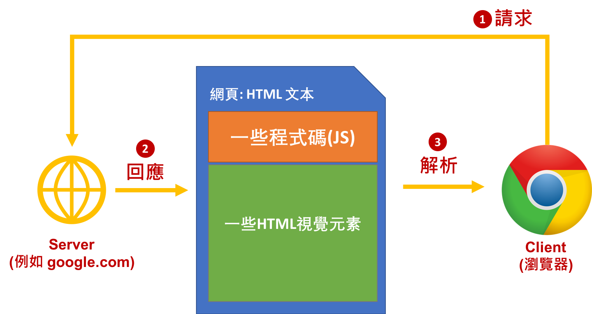
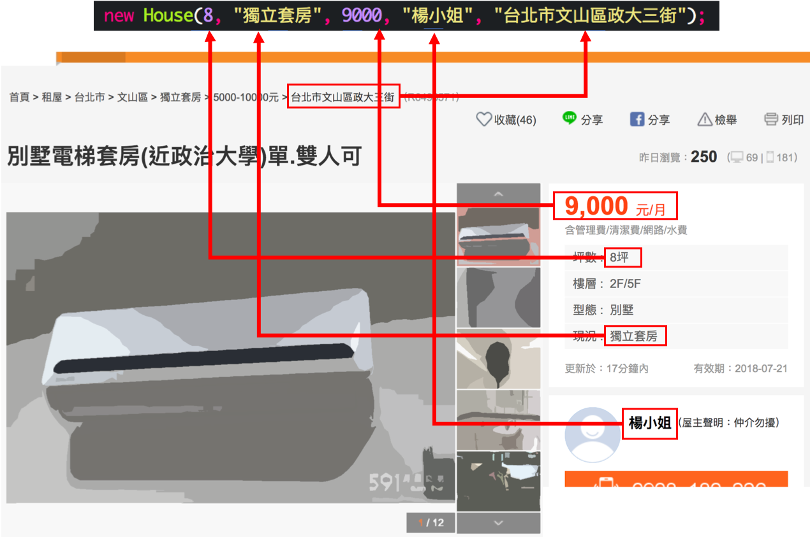
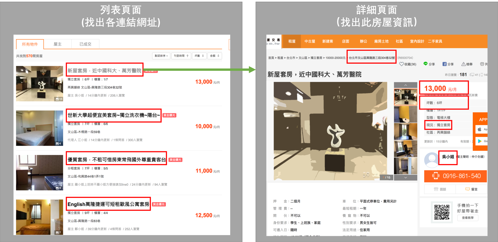

<!-- .slide: data-background="assets/background.png" -->

# 專題: 租屋小幫手
## 透過 jsoup 套件爬回網路上租屋資料

---

# 我們看到的網頁怎麼來的?

---

# 爬蟲程式 Crawler

---

# 瀏覽器 Inspect 工具

---

# 爬蟲程式 Crawler

* 一支 `看得懂` HTML文檔的程式
* 把我們需要的部分，抓取出來

---

# Jsoup HTML Parser

* 把一張 HTML文檔轉成 `結構化物件`
* 透過`查詢語言`查出我們需要的部分

---

## 透過 Maven
# 引用 Jsoup 套件

---

# 清理 App 類別原先流程

---

