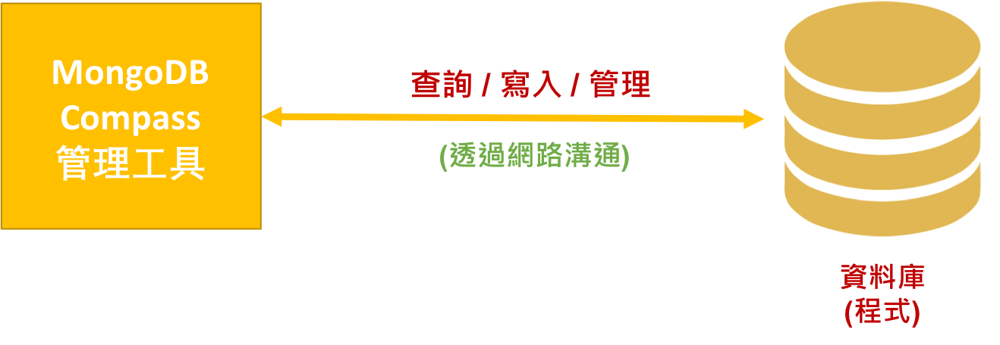

<!-- .slide: data-background="assets/background.png" -->

# 專題: 租屋小幫手
## 將爬回的資料永久儲存進 MongoDB 資料庫

---

# 資料庫 (Database/DB)
## 通常是獨立於程式之外，用來永久保存資料的場所

---

# 永久/持久 (Persistence)
## 是相對程式運行的生命週期而言

---

# 將租屋小幫手的 `houses` `HashMap`
## 序列化成`JSON`檔案，就算是持久化

---

# 存下的 JSON 檔
## 可以視為是超級精簡版的`資料庫`

---

# 資料庫基本工作

1. 提供程式`寫入`資料: 例如把租屋資料序列化到 JSON 檔當中
2. 提供程式`查詢`資料: 例如把租屋資料反序列化回 `houses` 變數中

> 而且是查詢全部的資料回來

---

# 對真正的資料庫，有更多要求

* 要提供`可擴充`的存放方式
* 要提供多樣化的查詢方式: 如`篩選查詢`
* 要能夠高速的傳回查詢結果

---

# 程式操作資料庫的架構

---

# 程式操作資料庫的架構

---

# 那我要了解網路溝通的細節嗎？

---

## 資料庫開發商通常會提供各語言 Driver Library

---

## 那我我要自己安裝 MongoDB 嗎?

---

# 使用 MongoDB Atlas 的雲端服務
## 來快速在雲端架設自己的 MongoDB
## 有免費方案！

---

# 資料庫架設好了
## 一定要寫自己程式碼才能開始操作資料庫嗎？

---

# 使用 MongoDB Compass 來瀏覽資料庫現況

---

# 資料庫管理工具

---

# MongoDB 怎麼存放資料?

* 一個架設好的 MongoDB 服務，可以建立多個資料庫
* 一個資料庫內，可以建立多個`集合 Collection`
* 一個集合內，可以存放多筆`文件 Document`

---

# 建立一個資料庫叫做 `rental_helper`

---

# 建立一個集合叫做 `houses`

---

# 寫入一個新的文件(一筆房屋資料)
> 類似 JSON 格式

---

# 目標: 資料全部寫入 MongoDB

* 汰除 `houses` 變數 (`HashMap`)
* 不需再使用 `Gson` 把變數序列化為檔案
* 不需再使用 `Gson` 反序列化回變數

---

# 移除 Gson Library 引用

---

# 引用 Morphia Library

---

# 透過標記告訴 Morphia
## 我們的 `House 類別`的實例
## 就是將來要寫入的文件

---

# MongoDB 有專門用來存放座標的型態
## `Point 類別`

---

# 建立不帶參數的建構方法
## 讓 Morphia 反序列化時要用的
