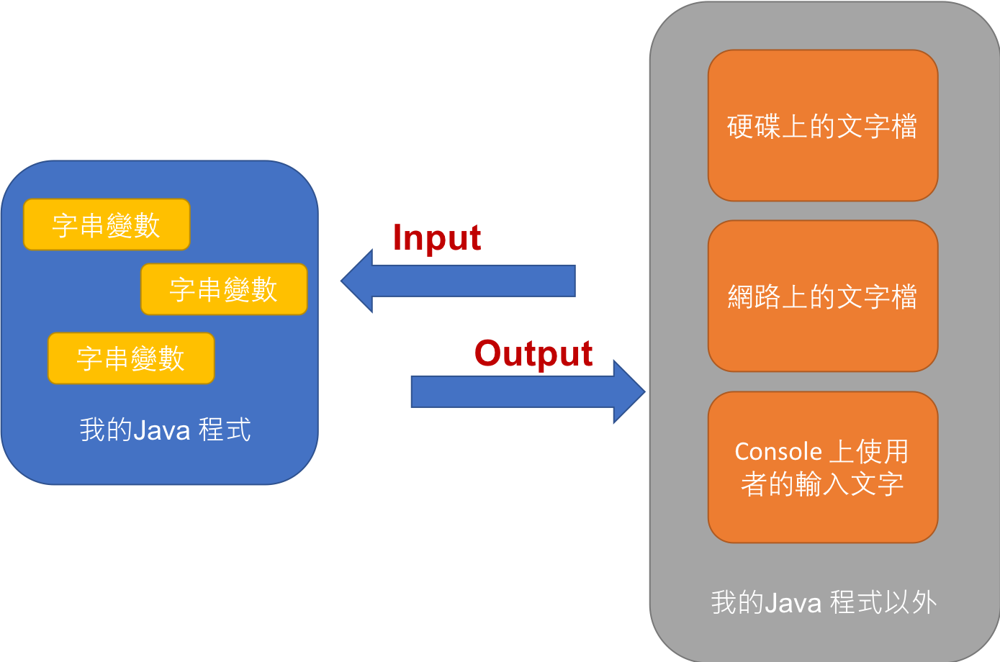
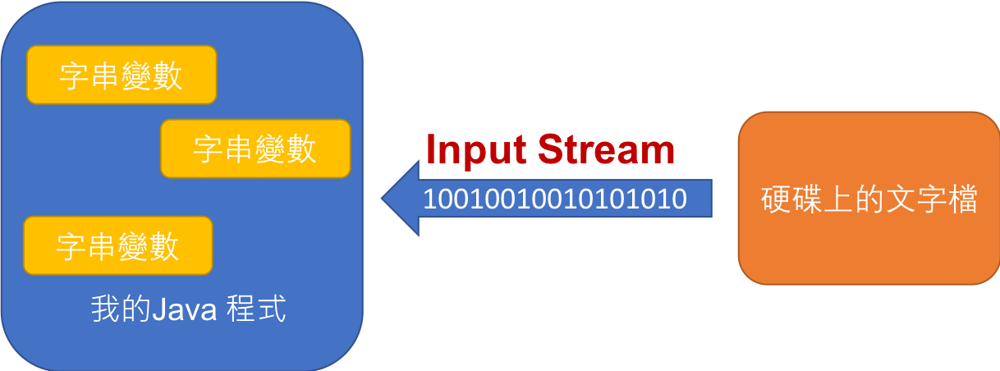

<!-- .slide: data-background="assets/background.png" -->


## 認識常用類別
## 文本IO: Scanner, PrintWriter 類別

---

# 文本

* 由很多`字元`組成的一段內容:
   * 一份文字檔的內容
   * 一份網頁裡的內容
   * 一個Java程式裡面的字串

---

# 文本存放在哪裡?

* 一份文字檔的內容: 在本機的`硬碟`上
* 一份網頁裡的內容: 在`遠端`的硬碟上
* 在Console裡的內容: 在`作業系統` 管理的記憶體中
* 一個 Java 程式裡面的字串: 在 `JVM` 管理的記憶體中

---

# 文本 I/O (Input/Output)

<div style="height: 40rem;">

</div>

---

# Input 最好分批進行

* 假設要寫一支程式，讀取硬碟上的一份檔案，並且印出完整哪容
* 方法1: 整份讀取，整份印出:

```java
String full = // 讀取整份檔案的內容 ;
System.out.println(full);
```

---

# Input 最好分批進行

* 方法2: 逐行讀取，逐行印出

```java
while(/*檔案還有下一行*/) {
    String line = // 讀取下一行 ;
    System.out.println(line);
}
```

---

# 透過 Scanner 來讀取文本 

* Scanner 是透過`分割模式`來切割文本

---

# 透過 Scanner 來讀取文本 

* 一份文本透過一種`分割模式`被切割出來的片段，稱為`token`
* 例如 `I have an apple`, 透過 `空白`切割，可得到以下 4 `tokens`:
  
```
I,have,an,apple
```

---

# 透過 Scanner 來讀取文本 

* 以下文本透過 `空白或換行` 切割:
```
I have an apple
I have a pen
```

* 可得到以下 8 `tokens`:
```
I,have,an,apple,I,have,a,pen
```

---

# 透過 Scanner 來讀取文本 

* Scanner 預設分割模式就是`空白或換行`
* Scanner 建構方法可以決定`文本來源`
* Scanner 可以逐`token`讀取

---

# Input Stream



---

# Scanner 實例方法

* 透過 `hasNext()` 來確認: 
  * `排除掉已經讀過的token`，是否還有下一個 token 在後面?

* 亦可透過 `hasNextInt()`, `hasNextFloat()` 來確認:
  * `排除掉已經讀過的token`，是否還有下一個可轉為 int/float 的 token 在後面?

---

# Scanner 實例方法

* 透過 `next()` 讀取下一個 token (傳回字串)
* 亦可透過 `nextInt()`,`nextFloat()` 等方法讀取下一個token字串後，順便轉型為基礎型別


---

# Scanner 實例方法

* 可透過 `hasNextLine()` 方法確認是否有下一行
* 可透過 `nextLine()` 方法把下一行讀進來 (傳回字串)

> 這裡看的就不是token, 而是行

---

```java
Scanner sc = new Scanner(System.in);
while (sc.hasNext()) {
    String token = sc.next();
    System.out.println("輸入: " + Integer.parseInt(token));
}
```

---

# 透過 Scanner 讀取並印出檔案

```java
Scanner sc = new Scanner(new File("此處放檔案路徑"));
while (sc.hasNextLine()) {
    String line = sc.nextLine();
    System.out.println(line);
}
sc.close();
```

---

# 記得手動關閉串流

```java
sc.close();
```

---

# Windows 路徑注意

* 如果你的檔案放在: `C:\Users\foo\bar\test.txt`
* 則路徑寫成字串時:
```java
Scanner sc = new Scanner(new File("C:\\Users\\foo\\bar\\test.txt"));
```

---

# Output 最好分批進行


* 假設要寫一支程式，生成如下檔案:
```
1
2
3
4
...
99
100
```

---

* 方法1: 字串整個組合好，然後一次寫出
```java
String result = "";
for(int i = 1; i <= 100; i++) {
    result = result + i;
    if(i < 100){
        result = result + "\n";
    }
}
// 然後把 result 在此處一次寫出成檔案 ...
```

---

* 方法2: 逐行寫出

```java
for(int i = 1; i <= 100; i++) {
    // 在檔案內尾巴加入 i 這個字...
    if(i < 100) {
        // 在檔案內尾巴加入一個換行符號...
    }
}
```

---

# 透過 PrintWriter 寫出檔案

```java
PrintWriter writer = new PrintWriter(new File("此處放檔案路徑"));
for (int i = 1; i <= 100; i++) {
    writer.print(i);
    if (i < 100) {
        writer.println();
    }
    writer.flush();
}
writer.close();
```