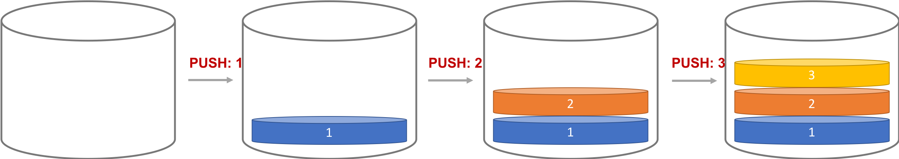
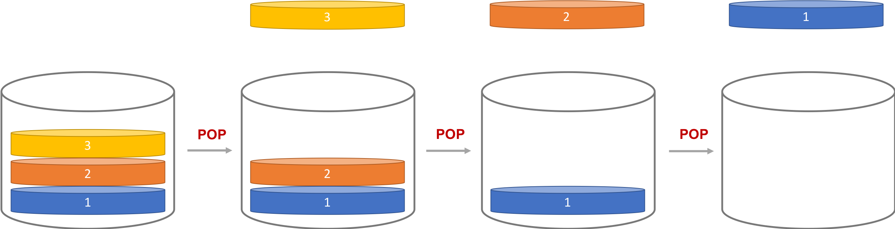

<!-- .slide: data-background="assets/background.png" -->


# Java 集合: List
# 認識 Stack 類別

---

# Stack (堆疊) 資料結構

* 放資料進入堆疊： PUSH
* 從堆疊拿一筆資料： POP



---

# Stack (堆疊) 資料結構



> 先進後出

---

# Stack Class

* `push(...)` 方法: 新增一個元素
* `pop()` 方法: 回傳被移除的元素
* `peek()` 方法: 回傳最頂層的元素

---

# 情境 & 思考

* 設計一程式，宣告一 Stack 用來記錄使用者輸入的字串
* 程式會不斷重複請使用者輸入`指令`
* 每一條指令做完後，都要印出身高陣列現況。

---

# 情境 & 思考

* 假設使用者輸入 `push A` 指令
  * 代表使用者想push `"A"`這個字到 Stack 中

---

# 情境 & 思考

```
請輸入指令:
push A
[A]
請輸入指令:
push B
[A,B]
請輸入指令:
push C
[A,B,C]
```

---

# 情境 & 思考

* 假設使用者輸入 `pop` 指令
  * 代表使用者想pop最頂層的元素離開Stack
  * 印出被移除的元素

---

# 情境 & 思考

```
...
[A,B,C]
請輸入指令:
pop
C
[A,B]
請輸入指令:
pop
B
[A]
```

---

# 情境 & 思考

* 假設使用者輸入 `peek` 指令
  * 印出最頂層的元素

---

# 情境 & 思考

```
...
[A,B,C]
請輸入指令:
pop
C
[A,B,C]
```