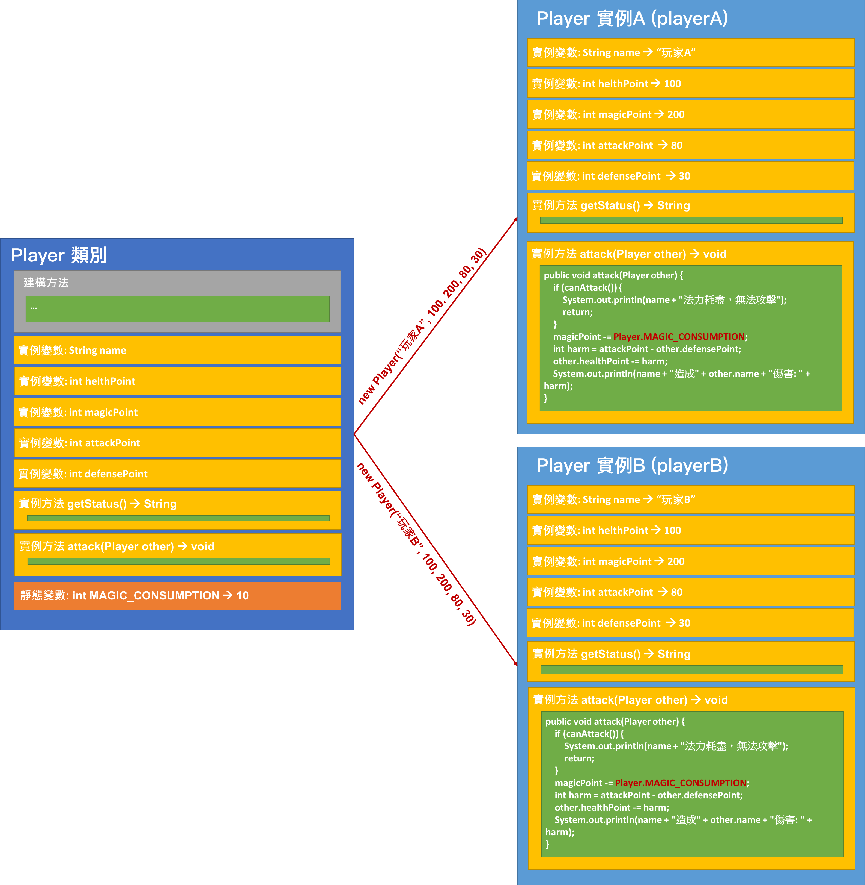
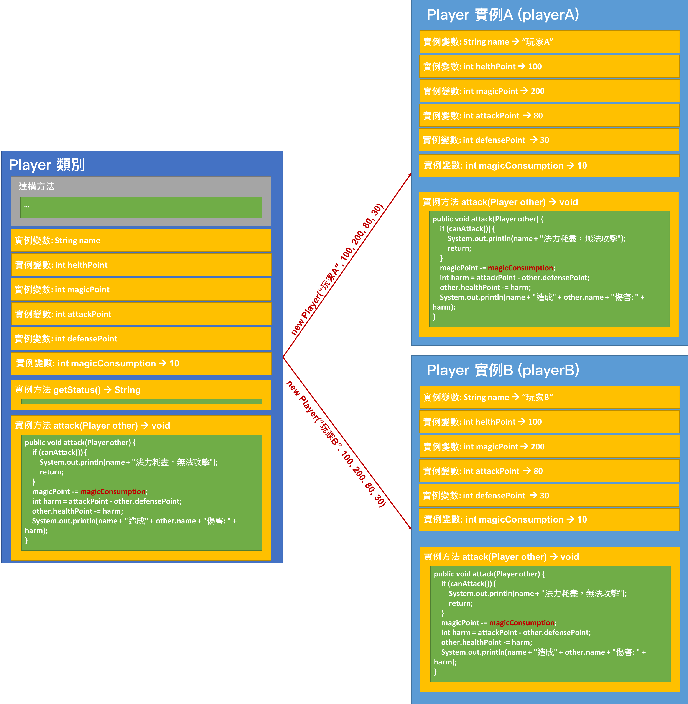
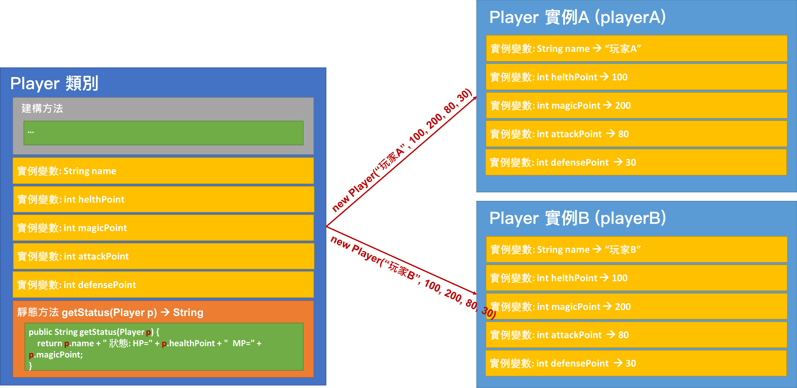
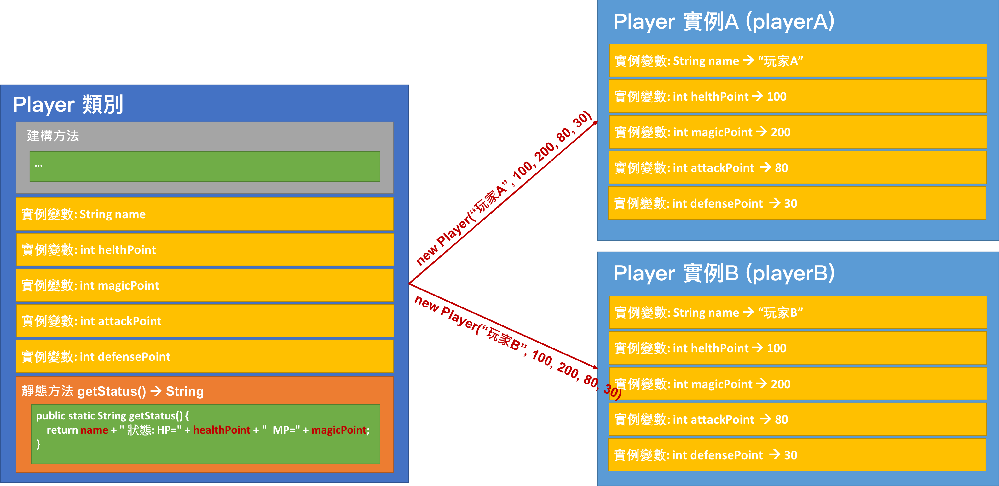

<!-- .slide: data-background="assets/background.png" -->


# static or not?
## 認識實例成員與靜態成員的使用時機

---

# 成員

<div style="height: 40rem;">

</div>


---

1. 該用 `靜態變數` 還是 `實例變數`?
2. 該用 `靜態方法` 還是 `實例方法`?

---

# 靜態變數 v.s 實例變數

---

<div style="height: 55rem;">

</div>

---

# 情境 & 思考

* 假設我們把 `MAGIC_CONSUMPTION` 改成實例變數

---

<div style="height: 55rem;">

</div>

---

# 靜態變數 v.s 實例變數

* 需要在實例之間 `共用` 的變數，採用`靜態變數`
* 實例各自擁有的，採用`實例變數`

---

# 靜態方法 v.s 實例方法

---

# 情境 & 思考

* 假設我們把 `getStatus()` 方法變成 `靜態方法`

```java
public static String getStatus(Player p) {
    return p.name + " 狀態 HP=" + p.healthPoint + " MP=" + p.magicPoint;
}
```

---





---

# 靜態方法 v.s 實例方法

* 會用到實例變數的話，採用`實例方法`
* 撰寫實例的行為，採用`實例方法`
* 不需要任何實例變數參與運算，採用 `靜態方法`

---

# 靜態方法內不能直接存取實例成員

