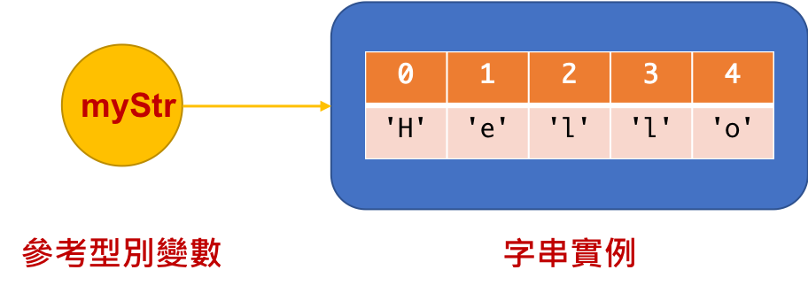
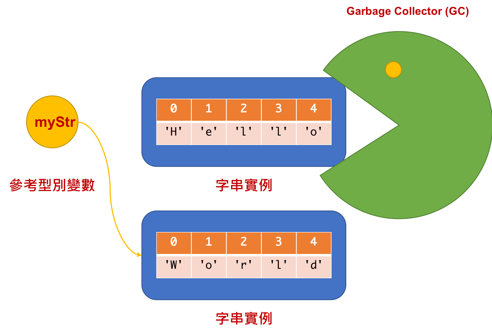
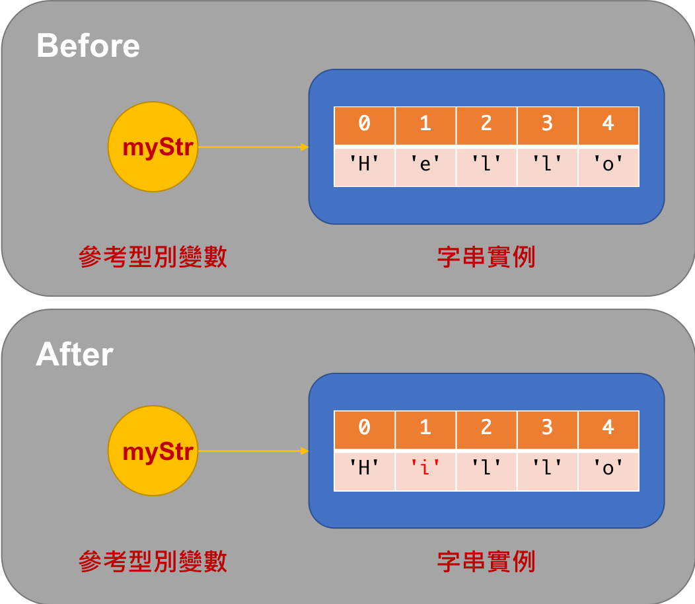
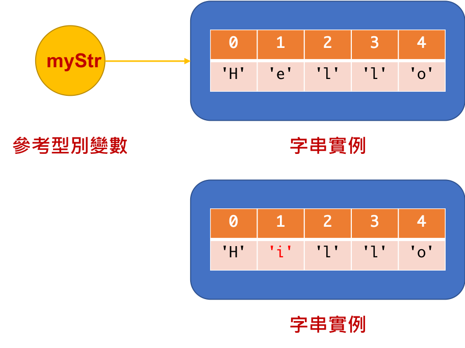
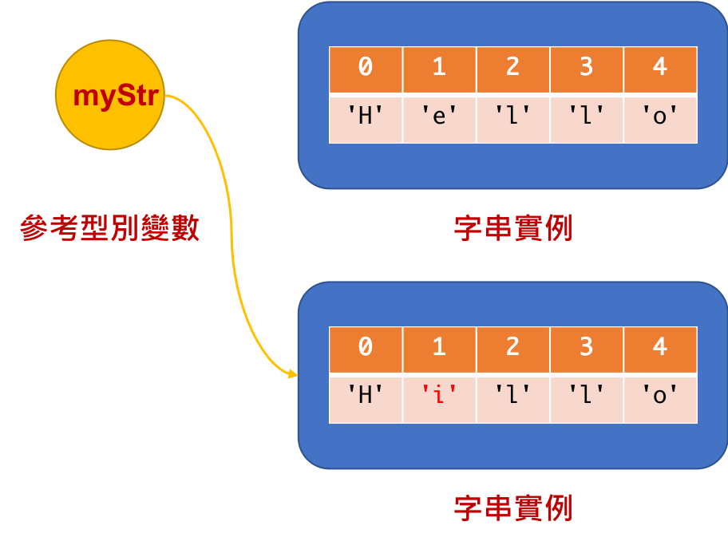
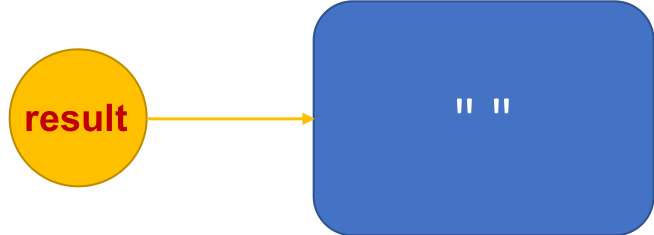
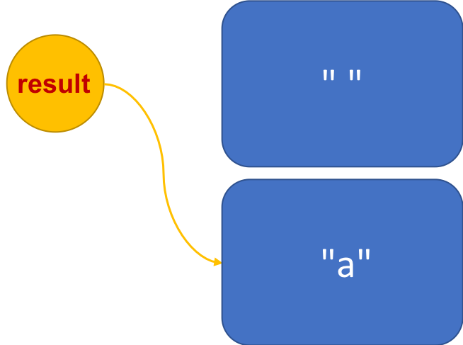
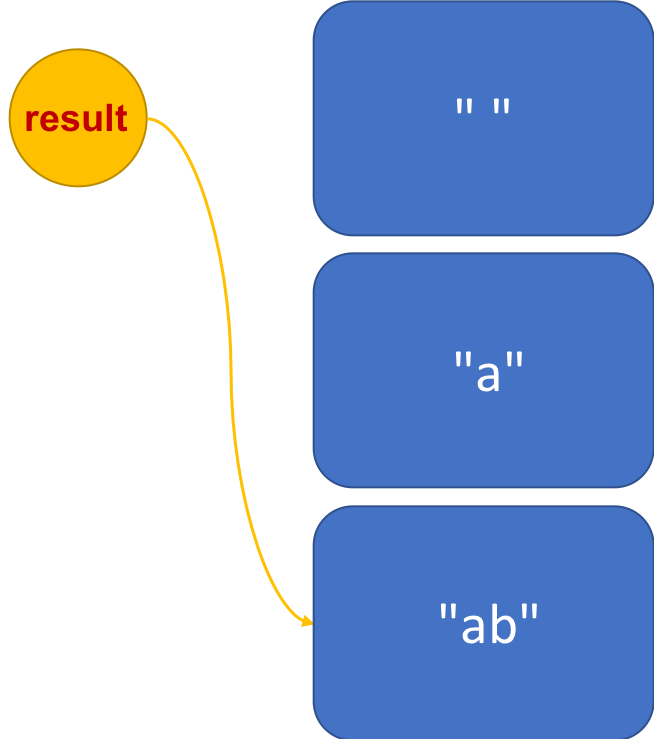
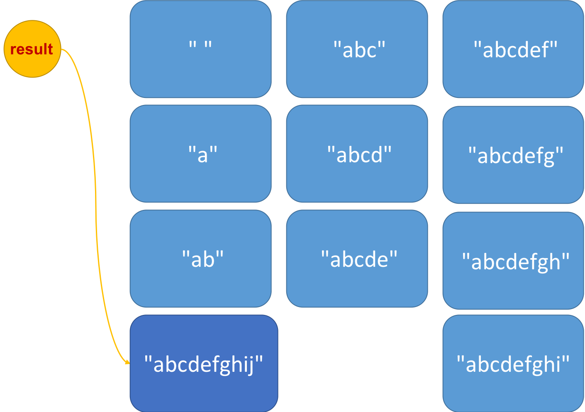

<!-- .slide: data-background="assets/background.png" -->


## 認識常用類別
## 字串處理: String, StringBuilder 類別

---

# 建構字串實例

* 字串是由一個`字元陣列`構成的，因此建構方法要傳入陣列

```java
String myStr = new String(new char[]{'H','e','l','l','o'});
```

---

# 建構字串實例

* 太過冗長，因此有專門的雙引號語法用來實作`String`實例
```java
String myStr = "Hello";
```

---

# 取回字串長度

* 使用`length()`實例方法

```java
String myStr = "Hello";
System.out.println(myStr+" 的長度是: "+myStr.length());
```

---

# 取回位於某位置的字元


* 使用`charAt(int index)`實例方法

```java
String myStr = "Hello";
System.out.println("位於索引 0 的字元"+myStr.charAt(0));
```

---

# 字串的『子字串』(Substring)

* `"abc"`的子字串:
  1. `"abc"`
  2. `"ab"`
  3. `"bc"`
  4. `"a"`
  5. `"b"`
  6. `"c"`
  7. `""`

---

# 判斷是否包含一段關鍵字(子字串)

* 使用`contains(CharSequence s)`實例方法

```java
String myStr = "Hello";
System.out.println("是否有包含 ell :" + myStr.contains("ell"));
System.out.println("是否有包含 hel :" + myStr.contains("hel"));
System.out.println("是否有包含空字串 :" + myStr.contains(""));
```

---

# 判斷是否開頭為...

* 使用`startsWith(String prefix)`實例方法

```java
String myStr = "Hello";
System.out.println("開頭字是否為 He :" + myStr.startsWith("He"));
System.out.println("開頭字是否為 Hel :" + myStr.startsWith("Hel"));
System.out.println("開頭字是否為 ell :" + myStr.startsWith("ell"));
System.out.println("開頭字是否為 hell :" + myStr.startsWith("hell"));
```

---

# 判斷是否結尾為...

* 使用`endsWith(String suffix)`實例方法

```java
String myStr = "Hello";
System.out.println("結尾字是否為 lo :" + myStr.endsWith("lo"));
System.out.println("結尾字是否為 llo :" + myStr.endsWith("llo"));
System.out.println("結尾字是否為 ell :" + myStr.endsWith("ell"));
System.out.println("結尾字是否為 eLLo :" + myStr.endsWith("eLLo"));
```

---

# 搜尋某一段關鍵字第一次出現的位置 (順向搜尋)

* 使用 `indexOf(String str)`實例方法，從頭搜尋

```java
String myStr = "Hello";
System.out.println("第一次出現 l 的位置" + myStr.indexOf("l"));
```

* 使用 `indexOf(String str, int fromIndex)`，可指定開始搜尋的位置

```java
System.out.println("從位置 3 開始搜尋，第一次出現 l 的位置" + myStr.indexOf("l",3));
```

---

# 搜尋某一段關鍵字最後一次出現的位置 (逆向搜尋)

* 使用 `lastIndexOf(String str)`實例方法，從尾搜尋
* 使用 `lastIndexOf(String str, int fromIndex)`實例方法，可指定開始搜尋的位置

```java
String myStr = "Hello";
System.out.println("最後一次出現 l 的位置" + myStr.lastIndexOf("l"));
System.out.println("從位置 2 開始逆向搜尋，最後一次出現 l 的位置" + myStr.lastIndexOf("l", 2));
```

---

# 字串切分/斷句

* 使用`split(String regex)` 實例方法

```java
String myStr = "I have a pen";
String[] words = myStr.split(" ");
for (int i = 0; i < words.length; i++) {
    System.out.println("第" + i + "個元素是: " + words[i]);
}
```

---

# 取代

* 使用 `replace(CharSequence target, CharSequence replacement)` 實例方法

```java
String myStr = "Hello";
myStr.replace("e" , "i");
System.out.println(myStr); // 為什麼還是 Hello?
```

---

# 為什麼沒有變化?

* 因為Java `String 實例`，都是`不可變`的實例(Immutable)
  * 亦即，實例被建構出來之後，其所有`實例變數`全部不可改動
* 因此，關於變動字串的操作，都是透過回傳值，回傳一個`改好的+全新的`另一個字串實例

---

# 字串的不可變動性

```java
String myStr = "Hello";
```


<!--說明不可變的是實例、而不是參考-->

---

# 還是可重新賦值給 myStr 變數

* 因為重新賦值給`myStr`跟實例不可變動性**無關**!

```java
String myStr = "Hello";
myStr = "World";
```
<div style="height: 30rem;">

</div>

---

# 我們以為...

```java
String myStr = "Hello";
myStr.replace("e" , "i");
```

<div style="height: 35rem;">

</div>

---

# 其實是...

```java
String myStr = "Hello";
myStr.replace("e" , "i");
```

<div style="height: 35rem;">

</div>

---

# 我們想留住取代後結果的話

```java
String myStr = "Hello";
str = myStr.replace("e" , "i");
```

<div style="height: 35rem;">

</div>

---

# 全部轉為大寫

* 使用 `toUpperCase()` 實例方法

```java
String myStr = "Hello";
myStr = myStr.toUpperCase();
System.out.println(myStr);  // HELLO
```

---

# 全部轉為小寫

* 使用 `toLowerCase()` 實例方法

```java
String myStr = "Hello";
myStr = myStr.toLowerCase();
System.out.println(myStr); // hello
```

---

# 去除頭尾的空白

* 使用 `trim()` 實例方法

```java
String myStr = "   Hello World       ";
myStr = myStr.trim();
System.out.println("\""+myStr+"\"");
```

---

# 取出一段子字串

* 使用 `substring(int begin)`實例方法，可以從某位置開始取到最後一字

```java
String myStr = "Hello";
myStr = myStr.substring(2);
System.out.println(myStr);
```

---

# 取出一段子字串

* 使用 `substring(int begin,int end)`實例方法，可以從某位置開始取到某位置結束

```java
String myStr = "Hello";
myStr = myStr.substring(2,4);
System.out.println(myStr);
```

---

# 判斷兩字串是否相等

* 透過`equals(Object anObj)`實例方法

```java
String myStr = "Hello";
System.out.println(myStr.equals("Hello"));
System.out.println(myStr.equals("hello"));
```

---

# 認識 StringBuilder 類別

---

# 情境 & 思考

* 撰寫一程式，讓使用者依次輸入10個字串
* 全輸完後，把剛剛接收到的多個字串，串接再一起並印出

---

# 情境 & 思考

```java
Scanner sc = new Scanner(System.in);
String result = "";
for (int i = 0; i < 10; i++) {
    System.out.println("請輸入第"+(i+1)+"個字:");
    result =  result + sc.next();
}
System.out.println("結果: "+result);
```

---

# 因為字串的不可變動

* 我們降低了空間利用效率


<div style="height: 35rem;">

</div>

---

<div style="height: 35rem;">

</div>

---

<div style="height: 35rem;">

</div>

---

<div style="height: 35rem;">

</div>

---

# StringBuilder 類別

* 可以想像成是`可變動版`的String
* 所有的字串變動，都在作用在同一個實例上面
* 在需要大量變動的情況下，比直接用 String 有效率
```java
Scanner sc = new Scanner(System.in);
StringBuilder resultBuilder = new StringBuilder();
for (int i = 0; i < 10; i++) {
    System.out.println("請輸入第"+(i+1)+"個字:");
    resultBuilder.append(sc.next());
}
System.out.println("結果: "+resultBuilder.toString());
```
