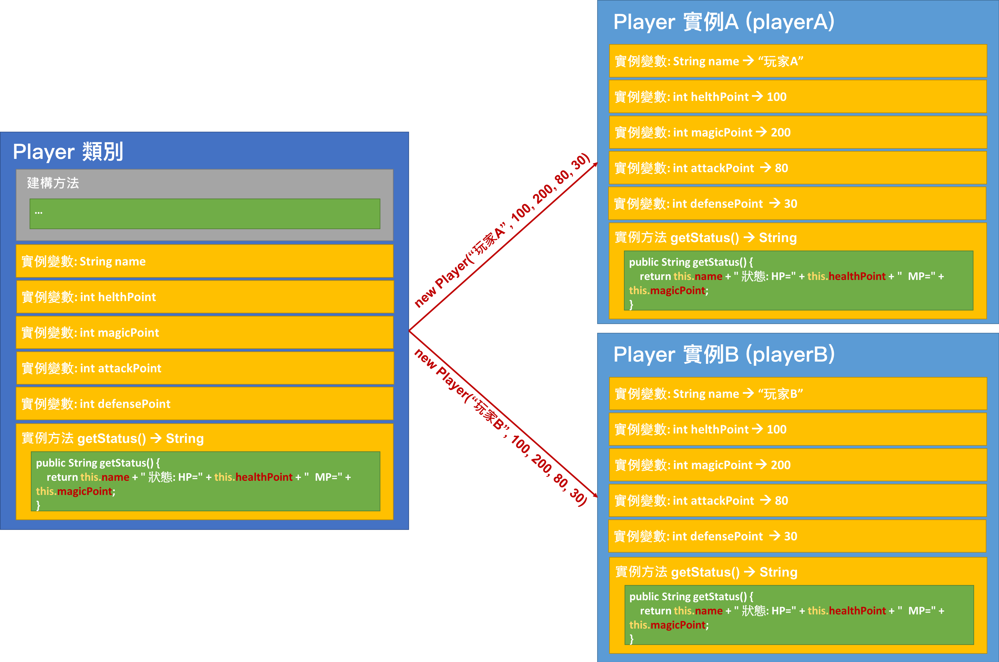

<!-- .slide: data-background="assets/background.png" -->


## 搞懂 this 關鍵字

---

# this 關鍵字

```java
public class Player {
	
	public String name;
	public int healthPoint;
	public int magicPoint;
	public int attackPoint;
	public int defensePoint;

	public Player(String name, int healthPoint, int magicPoint, int attackPoint, int defensePoint) {
		this.name = name;
		this.healthPoint = healthPoint;
		this.magicPoint = magicPoint;
		this.attackPoint = attackPoint;
		this.defensePoint = defensePoint;
	}
```

---

# 哪邊的陳述可以用 this ?

1. 實例方法
  * 用途1: 用來代表擁有此方法的`該實例`
2. 建構方法
  * 用途1: 用來代表即將實作出來的`該實例`
  * 用途2: 用來呼叫`其他建構方法`

---

# 哪邊的陳述可以用 this ?

<div style="height: 40rem;">

</div>

---

# 在實例方法內使用 this

```java
public String getStatus() {
    return this.name + " 狀態 HP=" + this.healthPoint + " MP=" + this.magicPoint;
}
```

---

<div style="height: 40rem;">

</div>

<!--另說明可省略的情況-->

---

# 在建構方法內使用 this

* 用途1: 用來代表即將實作出來的`該實例`

```java
public class Player {
	
	public String name;
	public int healthPoint;
	public int magicPoint;
	public int attackPoint;
	public int defensePoint;

	public Player(String name, int healthPoint, int magicPoint, int attackPoint, int defensePoint) {
		this.name = name;
		this.healthPoint = healthPoint;
		this.magicPoint = magicPoint;
		this.attackPoint = attackPoint;
		this.defensePoint = defensePoint;
	}
}
```

---

# 在建構方法內使用 this

* 用途2: 用來呼叫`其他建構方法`

---

# 情境 & 思考

* 幫`Player`類別加入另一個建構方法，只接受3參數 `name`,`healthPoint`, `magicPoint`
* 使用這個建構方法的話，`attackPoint` 和 `defensePoint` 採用以下預設值:
  * attackPoint = 80
  * defensePoint = 30

---

# this 關鍵字

1. 實例方法
  * 用途1: 用來代表擁有此方法的`該實例`
2. 建構方法
  * 用途1: 用來代表即將實作出來的`該實例`
  * 用途2: 用來呼叫`其他建構方法`


