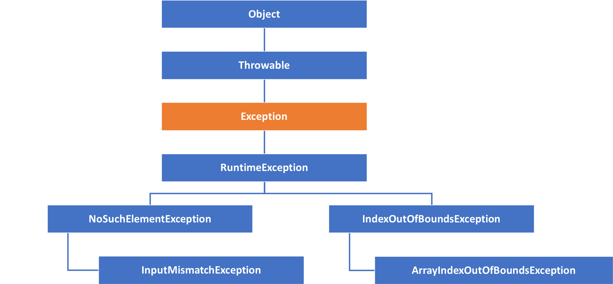

<!-- .slide: data-background="assets/background.png" -->


# 例外處理:
## 認識 try-catch-finally 控制結構

---

# 例外 Exception

* 程式執行過程中，發生了預期外的事件
  * 使用者不按規定輸入
  * 程式要去讀取檔案文本，卻發現檔案不存在
  * 要去讀取網路上的文本，卻發現網路不通

---

# 例外 Exception

* 例外的出現，會讓程式無法依照原定流程執行

---

# 情境 & 思考

* 宣告數字陣列: `[11,13,15]`
* 利用 `Scanner` 讀取使用者輸入的`索引值(0 ~ 2)`
* 印出數字陣列中，位於該索引的數字

---

# 情境 & 思考

```java
int[] numbers = new int[] { 11, 13, 15 };
		
Scanner sc = new Scanner(System.in);
System.out.println("請輸入索引: ");
int index = sc.nextInt();
int selected = numbers[index];

System.out.println("位於索引 "+index+" 的數字是:" + selected);
```

---

# 情境 & 思考

* 一旦發現使用者輸入`非整數`，就要印出 `數字錯誤`
* 一旦發現使用者輸入`錯誤的索引`，就要印出 `索引錯誤`
  
---


# 方法一: 提前檢查

* 提前檢查，讓程式完全執行不到有風險的陳述
```java
int[] numbers = new int[] { 11, 13, 15 };

Scanner sc = new Scanner(System.in);
System.out.println("請輸入索引: ");
int index = sc.nextInt();

if (index < 0 || index >= numbers.length) {
    System.out.println("索引錯誤");
    return;
}

int selected = numbers[index];
System.out.println("位於索引 " + index + " 的數字是:" + selected);
```

---

# 方法二: 讓程式`試著`執行

* 讓程式`試著`執行到有風險的陳述看看，真的出現例外再來處理
* 使用 `try...catch` 控制結構

---

# 情境 & 思考

* 假設現在無論是：
  1. 使用者沒有輸入整數
  2. 使用者沒有輸入正確索引
* 都只要印出 `輸入錯誤` 就好

---

# 例外處理

```java
try
{
    int[] numbers = new int[] { 11, 13, 15 };
    Scanner sc = new Scanner(System.in);
    System.out.println("請輸入索引: ");
    
    int index = sc.nextInt();

    int selected = numbers[index];
    System.out.println("位於索引 " + index + " 的數字是:" + selected);
}
catch (InputMismatchException | ArrayIndexOutOfBoundsException e) {
    System.out.println("輸入錯誤");
}
```

---

# 例外是被`擲出`的
## 所以我們才能`捕獲`

---

# 例外其實是一種 Exception 的`實例`

* 被`擲出`的是`例外實例`
* 被`捕獲`的也是該`例外實例`


---

# 例外其實是一種 Exception 類的`實例`

* 當中封裝了關於錯誤的相關訊息
* 這些訊息有時候對程式是有用的

---

# 例外其實是一種 Exception 類的`實例`



---

# finally 區段

* 只要程式開始執行`try`區段內的陳述
* 不論有無捕獲例外，最後都會來執行`finally`區段
* 通常用來進行資源的釋放

---

# finally 區段

```java
Scanner sc = new Scanner(System.in);
try {
    int[] numbers = new int[] { 11, 13, 15 };
    
    System.out.println("請輸入索引: ");

    int index = sc.nextInt();

    int selected = numbers[index];
    System.out.println("位於索引 " + index + " 的數字是:" + selected);
} catch (InputMismatchException | ArrayIndexOutOfBoundsException e) {
    System.out.println("輸入錯誤");
    
} finally {
    System.out.println("執行 finally 區段");
    sc.close();
}
```

