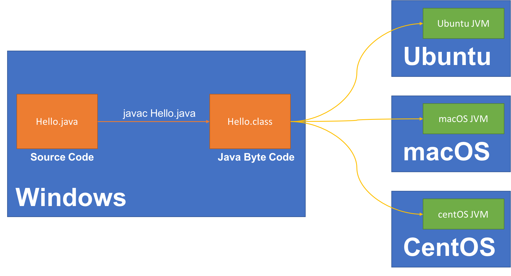
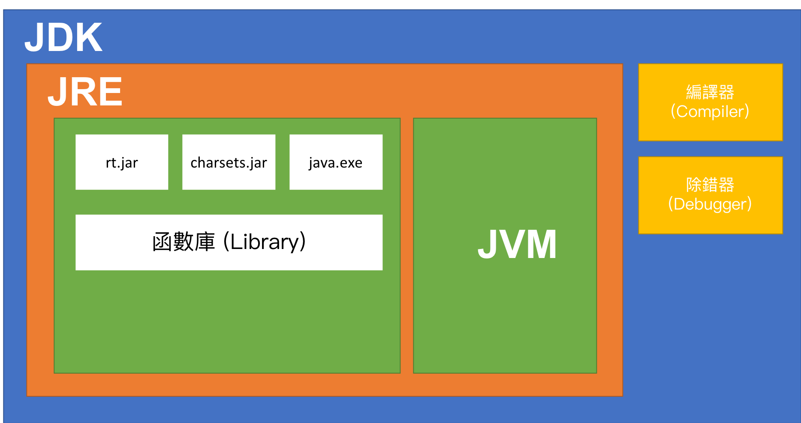
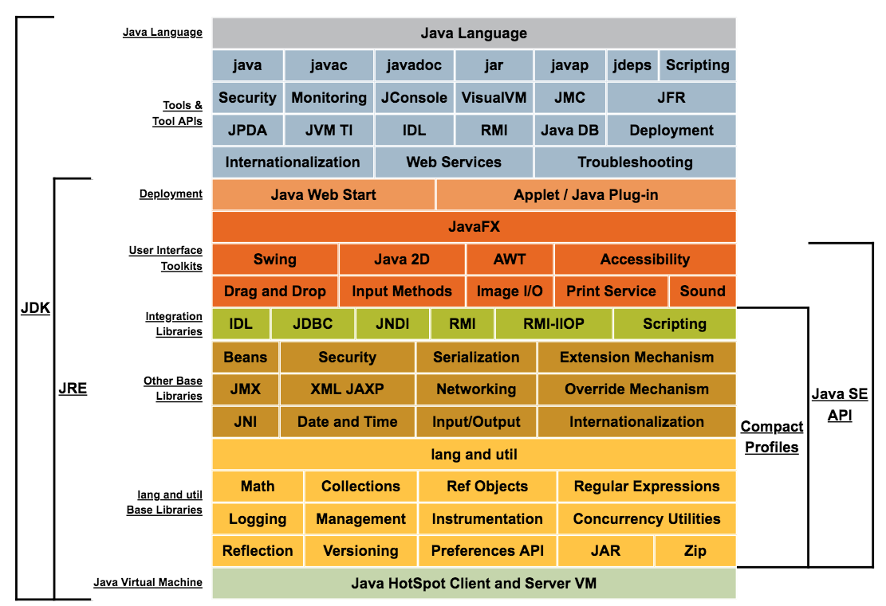
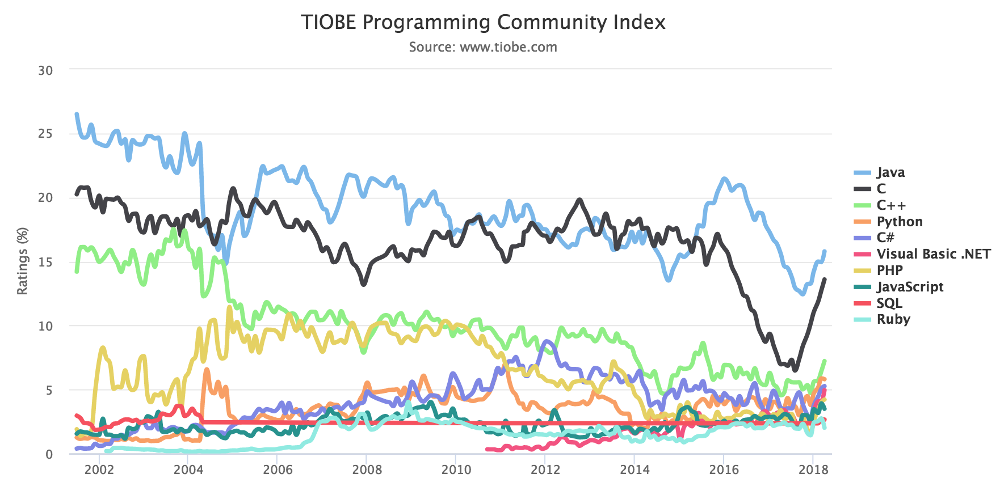

<!-- .slide: data-background="assets/background.png" -->


## 'Java' 到底是什麼？

---

# Java 的前身 - Oak

* 1990 年 Sun Microsystems (昇陽電腦) 開始進行一個名為 Green 的專案
* Oak 語言被設計用來開發Green 專案內Star7 裝置上的應用程式
* 1995 年 Sun 將 Oak 改名為 Java Development Kits 1.0a2 正式公開對外發行

---

# Java Applet

* 1996 年Netscape , IE 相繼支援Java Applet
* Star7 賣的不好，Green 專案被取消，但是全球資訊網卻給了 Java 延續生命的機會

---

# Java 版本演進

| 版本           | 代碼           | 時間      |
| ------------- |:-------------:| ---------:|
| JDK 1.1.4     | Sparkler      | 1997/9/12 |
| JDK 1.1.5     | Pumpkin       | 1997/12/3 |
| JDK 1.1.6     | Abigail       | 1998/4/24 |
| JDK 1.1.7     | Brutus        | 1998/9/28 |
| JDK 1.1.8     | Chelsea       | 1999/4/8  |
| J2SE 1.2      | Playground    | 1998/12/4 |

---

# Java 2 Platform, Standard Edition

* 1998 年 Sun 在 JDK 發行到 1.2 後，將其改名為Java 2 Platform, Standard Edition
* 簡稱 J2SE
* 隔年，Sun 為了用途越來越廣泛的Java 確立了三大架構
  1. J2SE: Java 2 Platform, Standard Edition
  2. J2EE: Java 2 Platform, Enterprise Edition
  3. J2ME: Java 2 Platform, Micro Edition

> 2006 年這三大架構，分別被改名為 Java SE, Jave EE, Jave ME


---

# Java 版本演進 (J2SE 時期)

| 版本           | 代碼           | 時間      |
| ------------- |:-------------:| ---------:|
| J2SE 1.2.1    | 無            | 1999/3/30 |
| J2SE 1.2.2    | Cricket       | 1999/7/8  |
| J2SE 1.3      | Kestrel       | 2000/5/8  |
| J2SE 1.3.1    | Ladybird      | 2001/5/17 |
| J2SE 1.4.0    | Merlin        | 2002/2/13 |
| J2SE 1.4.1    | Hopper        | 2002/9/16 |
| J2SE 1.4.2    | Mantis        | 2003/6/26 |
| J2SE 5.0      | Tiger         | 2004/9/29 |


---

# J2SE 5.0 

* 2004 年的J2SE 版號直接跳到5.0, 而不是 1.5
* 為了凸顯這個版本加入的特性跟之前很不同, 例如
  1. Generics
  2. Enumeration
  3. Annotation

---

# Java 版本演進 (Java SE 時期)

| 版本           | 代碼           | 時間      |
| ------------- |:-------------:| ---------:|
| Java SE 6     | Mustang       | 2006/12/23 |
| Java SE 7     | Dolphin       | 2011/7/28  |
| Java SE 8     | Spider        | 2014/3/18 |

* 2006 年推出的Java 開始棄用J2 的簡稱，直接改為Java SE

* 2010 年 Oracle (甲骨文公司) 併購Sun Microsystems， 因此 Java 現為Oracle 旗下之產品。


---

# WORA

* 透過Java 開發的程式，能夠有 WORA 的特性
* WORA = Write Once, Run Anywhere

---

# Java 如何達成跨平台？

* 開發時：
```
Java 原始碼  ---透過Java編譯器---> Java Byte Code
```

* 運行時：
```
Java Byte Code ---透過Java VM---> 運行電腦的處理器指令
```

> JVM = Java Virtual Machine

---

# Java 如何達成跨平台？



---

# 認識 JDK, JRE, JVM





---

# 所以現在的 Java 是什麼？

1. 是一個程式語言？
2. 是一個程式運行的平台(Java SE)?
3. 是一個有API 類別庫(Library) 的SDK?

---

# Java SE 的組成

<div style="height: 50rem;">

</div>

---

# Java 的影響力



---

# 開始進入Java的世界吧

