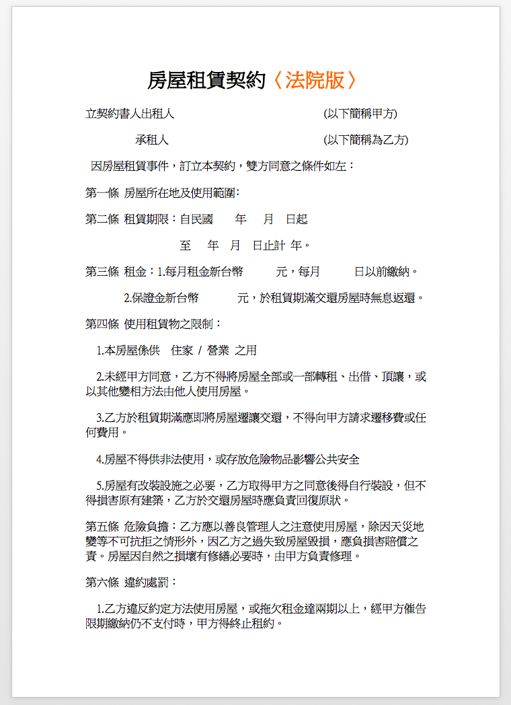

<!-- .slide: data-background="assets/background.png" -->


# 為什麼要有泛型
## (Generics)

---

# 情境 & 思考

* 班上有 `某甲`、`某乙`、`某丙`，三位同學
* 他們三人的座號分別是`11`,`22`,`33`
* 他們三人當中，每天要有一個人去擦黑板

---

# 情境 & 思考

* 他們三人為了誰該擦黑板而爭論不休，因此決定設計一個開獎機器，每天從三人座號中抽出要擦黑板的人的座號。

---

# 情境 & 思考

* 首先，要先有一個 `RandomIntPicker`類別代表一台整數字開獎機器
* 這台機器的操作分為兩個階段：
  1. `事前設定`: 事前告訴機器可能被抽出的號碼選項有哪些(一定要剛好三個)
  2. `正式開獎`: 事前設定完畢後，就能從可能的號碼選項中，隨機挑出一個出來

---

# 情境 & 思考

* 事前設定: 
  * 在 `RandomIntPicker` 類別中，封裝建構方法 `RandomIntPicker(int optionA, int optionB, int optionC)`
  * 用來對機器設定號碼選項

---

# 情境 & 思考

* 正式開獎:
  * 在 `RandomIntPicker` 類別中，封裝實例方法 `int generate()`

---

# 在 main 方法中開始使用抽獎機

```java
public static void main(String[] args) {
    RandomIntPicker randIntPicker = new RandomIntPicker(11, 22, 33);
    System.out.println("今天要擦黑板的人是: " + randIntPicker.generate() + "號");
}
```

---

# 情境 & 思考

* 某天，三人又因為晚餐究竟要吃`滷肉飯`、`雞肉飯`、`鵝肉飯`哪種而爭論不休。

---

# 情境 & 思考

* 於是這次又想設計一個字串開獎器，也就是說：
  1. `事前設定`：設定三個字串選項(`"滷肉飯"`、`"雞肉飯"`、`"鵝肉飯"`)
  2. `正式開獎`: 事前設定完畢後，就能從可能的字串選項中，隨機挑出一個出來

---

# 情境 & 思考

* 晚餐的事情解決後沒多久，三人又因為該用班費買多寬的班級置物櫃而爭論不休。
* 因為可添購的置物櫃有: `1.5`, `2.5`, `3.5` 這三種尺寸。

---

# 情境 & 思考

* 於是這次又想設計一個浮點數開獎器，也就是說：
  1. `事前設定`：設定三個字串選項(`1.5`、`2.5`、`3.5`)
  2. `正式開獎`: 事前設定完畢後，就能從可能的浮點數選項中，隨機挑出一個出來

---

## `RandomIntPicker`, `RandomStringPicker`, `RandomFloatPicker`
# 明明都程式碼極為相近，卻要重複寫三次

---

# 可以預想，未來類似的`開獎機`需求會越來越多
> Random`XXXX`Picker

---

# 泛型 (Generics)
## 就是用來解決這種重工的情況

---

# 一套模板，重複使用


---



---

# 一套模板，重複使用

```java
public class RandomPicker {
	private ▒▒▒▒▒▒ optionA;
	private ▒▒▒▒▒▒ optionB;
	private ▒▒▒▒▒▒ optionC;

	public RandomPicker(▒▒▒▒▒▒ optionA, ▒▒▒▒▒▒ optionB, ▒▒▒▒▒▒ optionC) {
		this.optionA = optionA;
		this.optionB = optionB;
		this.optionC = optionC;
	}

	public ▒▒▒▒▒▒ generate() {
		 int rand = ThreadLocalRandom.current().nextInt(0, 3);
		 if(random == 0){
			 return optionA;
		 }else if(random == 1){
			 return optionB;
		 }
		 else{
			 return optionC;
		 }
	}

}
```

---

# Java 在`沒有泛型`的時候
# 怎麼解決這個問題？

---

# 答案是利用 `多型`
## 但是拿多型來處理本情境會引發後續問題

---

# 泛型
## 提供`可靠性`