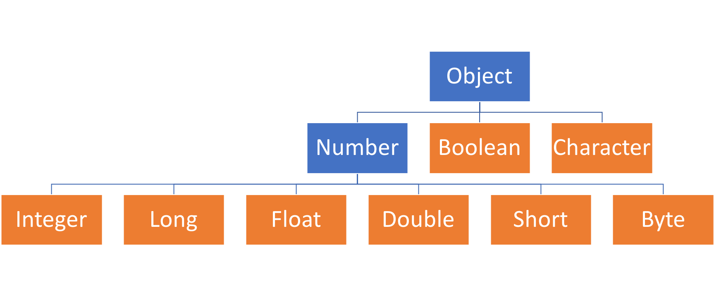

<!-- .slide: data-background="assets/background.png" -->


## 認識常用類別
## 數值處理: Integer, Long, Float, Double, Short, Byte 類別

---

# 基礎型別的包裝類別

| 基礎型別 | 包裝類別 |
| ------ | ------ |
| int    | `Integer` |
| long   | `Long`   |
| float  | `Float`  |
| double  | `Double`  |
| short  | `Short`  |
| byte  | `Byte`  |
| boolean  | Boolean  |
| char  | Character  |


---

# 包裝類別的繼承關係



---

# 實作出一個 Integer 實例

```java
int a = 1;
Integer b = new Integer(a);
```

---

# Integer 實例方法

* 透過 `intValue()` 實例方法得回基礎型別

```java
Integer b = new Integer(a);
int c = b.intValue();
```

---

# 轉型: 實例方法

* 除了`intValue()`，還可以透過下列方法轉型:
  * `longValue()`
  * `floatValue()`
  * `doubleValue()`
  * `shortValue()`
  * `byteValue()`

> 這系列方法其實是定義在Number 類別，因此繼承Number子類都有

---

# 取得對應字串值: 實例方法

* 透過 `toString()`

```java
int a = 1;
Integer b = new Integer(a);
String str = b.toString();
System.out.println("str = " + str);
System.out.println(str.equals("1"));
```

---

# 把字串解析為整數: 靜態方法

* Integer:
  * `Integer.parseInt(String s)`
  * `Integer.parseInt(Strings, int radix)` 
* Long:
  * `Long.parseLong(String s)`
  * `Long.parseLong(Strings, int radix)` 


> Short, Byte 類別也有

---

# 把字串解析為整數: 靜態方法

```java
int a = Integer.parseInt("987");
int b = Integer.parseInt("A1", 16);

System.out.println(a);
System.out.println(b);
```

---

# 把字串解析為小數: 靜態方法

* Float:
  * `Float.parseFloat(String s)`
* Double:
  * `Double.parseDouble(String s)`

---

# 把字串解析為小數: 靜態方法

```java
float a = Float.parseFloat("3.1");
double b = Double.parseDouble("3.123456");

System.out.println(a+1);
System.out.println(b+1);
```

---

# 把整數轉成`其他進位制`的字串: 靜態方法


```java
System.out.println("161 的 16進位 表示法: "+Integer.toHexString(161));
System.out.println("161 的 8進位 表示法: "+Integer.toOctalString(161));
System.out.println("161 的 2進位 表示法: "+Integer.toBinaryString(161));
```


---

# 取得數值型別的最大、最小值

```java
System.out.println("int 的範圍:" + Integer.MIN_VALUE + " ~ " + Integer.MAX_VALUE);
System.out.println("long 的範圍:" + Long.MIN_VALUE + " ~ " + Long.MAX_VALUE);
System.out.println("float 的範圍:" + Float.MIN_VALUE + " ~ " + Float.MAX_VALUE);
System.out.println("double 的範圍:" + Double.MIN_VALUE + " ~ " + Double.MAX_VALUE);
System.out.println("short 的範圍:" + Short.MIN_VALUE + " ~ " + Short.MAX_VALUE);
System.out.println("byte 的範圍:" + Byte.MIN_VALUE + " ~ " + Byte.MAX_VALUE);

```

---

# Autoboxing 機制

* Java 編譯器會視需要，自動把 `基礎型別` 數值轉成對應的 `包裝型別` 實例

```java
int a = 1;
Integer b = a;
Integer d = 2;
```

---

# Unboxing 機制

* Java 編譯器會視需要，自動把 `包裝型別` 實例 數值轉成對應的 `基礎型別` 數值 

```
Integer a = 3;
int b = a;
```